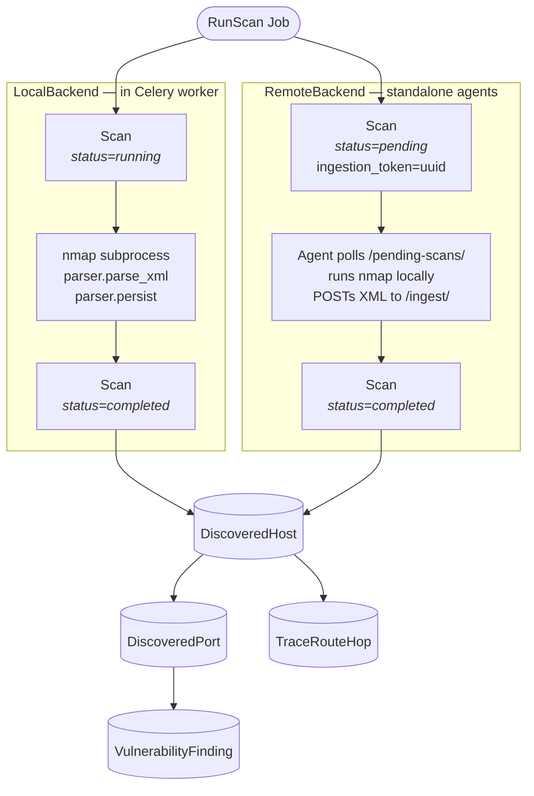
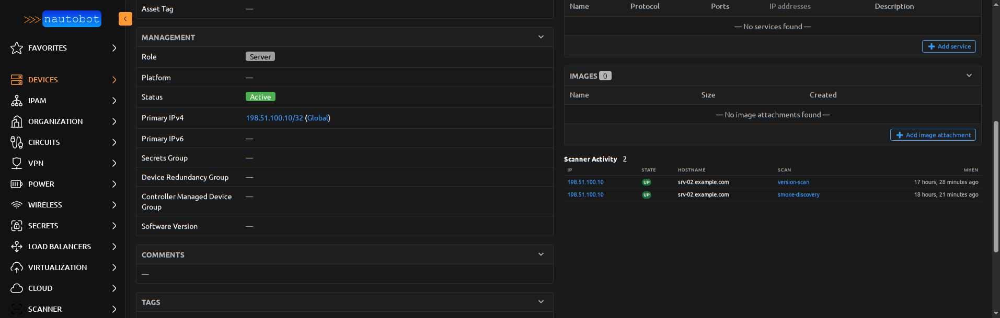
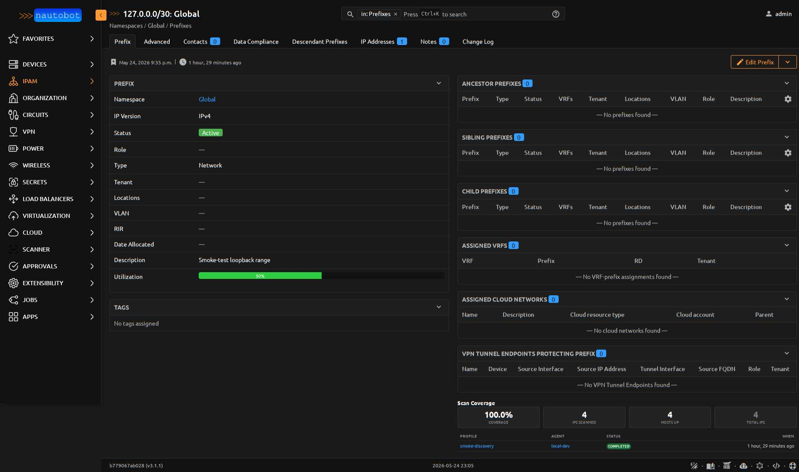

# nautobot-app-scanner

[](https://opensource.org/licenses/Apache-2.0)
[](https://www.python.org/downloads/)
[](https://docs.nautobot.com/)
[](https://github.com/rsp2k/nautobot-app-scanner/releases)

**nmap inside Nautobot.** Scan IPAM-defined targets, store hosts / ports / services / CVEs as first-class models, and surface results directly on the `dcim.Device`, `ipam.IPAddress`, and `ipam.Prefix` pages your team already uses.


## What it does

| | |
|---|---|
| **Targets you already have** | Scans `ipam.Prefix` and `ipam.IPAddress` records — no separate target list to maintain. |
| **Two execution models** | Run nmap inside the Nautobot worker (`LocalBackend`), or off-load to one or many remote agents (`RemoteBackend`) for DMZ / OT / branch segments Nautobot can't reach. |
| **Read-only by default** | Scan output lives in *separate* `DiscoveredHost` / `DiscoveredPort` / `VulnerabilityFinding` models. Promote-to-IPAddress and Promote-to-Device are explicit, permission-gated escape hatches. |
| **Where you'll look anyway** | A `TemplateExtension` injects scanner panels onto Device / IPAddress / Prefix detail pages, so you find scan data where you find everything else. |
| **Real nmap, not a wrapper** | Profiles are nmap argument strings (`-sS -sV -O --top-ports 1000` etc.). The seeded catalog covers discovery, port-scan, OS fingerprint, full-TCP, vuln, traceroute, and UDP. Write your own in 30 seconds. |
| **First-class job machinery** | Scans dispatch via Nautobot Jobs — scheduling, audit trail, log streaming, retry, JobResult page all come free. |

## How it works



The local backend is two containers (Nautobot + worker) and a single Python dependency. Remote agents are a single Python file in a Docker container — three included compose variants cover host-network, bridge-network, and dev-bridge scenarios.

### Where scan data shows up

<table>
<tr>
<td valign="top" width="50%">

**On a `dcim.Device` detail page**

Auto-linked by IP match against `Device.primary_ip4/6` at ingest time — no manual linkage step.



</td>
<td valign="top" width="50%">

**On an `ipam.Prefix` detail page**

Coverage stats (% IPs scanned, hosts up, recent scans) cached for 5 minutes so /16s don't stall the page.



</td>
</tr>
</table>

## Install

```bash
pip install nautobot-app-scanner
```

Then in `nautobot_config.py`:

```python
PLUGINS = ["nautobot_scanner"]
```

…and:

```bash
nautobot-server migrate
nautobot-server post_upgrade
```

The migration ships a 7-profile catalog (`discovery`, `top-100-tcp`, `os-detect`, `full-tcp`, `vuln`, `topology`, `udp-common`) seeded via `get_or_create` — your edits survive subsequent migrations.

## Quickstart — dev environment

```bash
git clone https://github.com/rsp2k/nautobot-app-scanner
cd nautobot-app-scanner
cp development/.env.example development/.env
# edit development/.env: set DOMAIN and rotate the changeme- secrets
make build
make up
make migrate
```

Browse to `https://${DOMAIN}/` (Caddy handles TLS) and log in with the seed superuser. Then **Apps > Scanner > Scanner Agents > Add** a local agent, **Jobs > Run Scan**, and pick a `Prefix` from your IPAM as the target.

The full dev guide — including the docker external-network setup and the `smoke_local_scan.py` helper — lives at [docs/dev/dev_environment.md](docs/dev/dev_environment.md).

## Remote agents

For scanning network segments Nautobot can't reach (DMZ, OT, branch offices, partner peers), the [`agent/`](agent/) directory ships a containerized reference agent. Same image, three compose variants:

| Mode | When to use it | Compose file |
|---|---|---|
| **Host network** | LAN scanning, SPAN ports, physical interfaces, OT segments | `agent/docker-compose.host-mode.yml` |
| **Bridge / attached** | Inventorying services inside a specific docker overlay | `agent/docker-compose.bridge-mode.yml` |
| **Dev-bridge** | Local development against the dev stack | `agent/docker-compose.dev-bridge.yml` |

Agent auth uses a dedicated `auth.User` per `ScannerAgent` (auto-created via signal) with a DRF Token as the bearer credential. Custom agents in any language can speak the [Agent Protocol](docs/dev/agent_protocol.md) — it's three HTTP endpoints.

## Docs

| | |
|---|---|
| **[App Overview](docs/user/app_overview.md)** | What the app stores and how it integrates with the rest of Nautobot |
| **[Running Scans](docs/user/running_scans.md)** | Dispatch via Jobs, scheduling, overlap policy, cancellation |
| **[Scan Profiles](docs/user/scan_profiles.md)** | The 7 shipped profiles, how to write your own, NSE script handling |
| **[Promote a Discovered Host](docs/user/promotion.md)** | Promote-to-IPAddress and Promote-to-Device flows |
| **[Scanner Agents](docs/user/agents.md)** | Local vs remote, liveness, the offline marker |
| **[Install Remote Agent](docs/admin/install_remote_agent.md)** | Operational deploy walkthrough — 6 steps + troubleshooting |
| **[Agent Protocol](docs/dev/agent_protocol.md)** | REST contract for custom agents |
| **[Architecture Decisions](docs/dev/architecture.md)** | Why this app looks the way it does (and what's deliberately out of scope) |

A full MkDocs site is bundled with the app — once installed, browse it in-app at **Apps > Scanner > docs** or build it locally with `mkdocs serve`.

## What's *not* here

A few common asks that were deliberately scoped out — each one has a reason in [Architecture Decisions](docs/dev/architecture.md):

- **Auto-sync IPAM from scans** — false positives become permanent IPAM rows. Use Promote.
- **Custom cron scheduler** — Nautobot's built-in Job scheduler does this. Don't reinvent.
- **`ARPBinding` model** — `DiscoveredHost.mac_address` already captures ARP-resolved MACs.
- **A `ServiceFingerprint` model** — fingerprint fields live directly on `DiscoveredPort`; nmap's `-sV` produces them with `service_name` anyway.

## Contributing

Issues and PRs welcome. See [CONTRIBUTING](docs/dev/contributing.md) for the dev loop and coding standards.

## License

[Apache-2.0](LICENSE) — © Ryan Malloy
