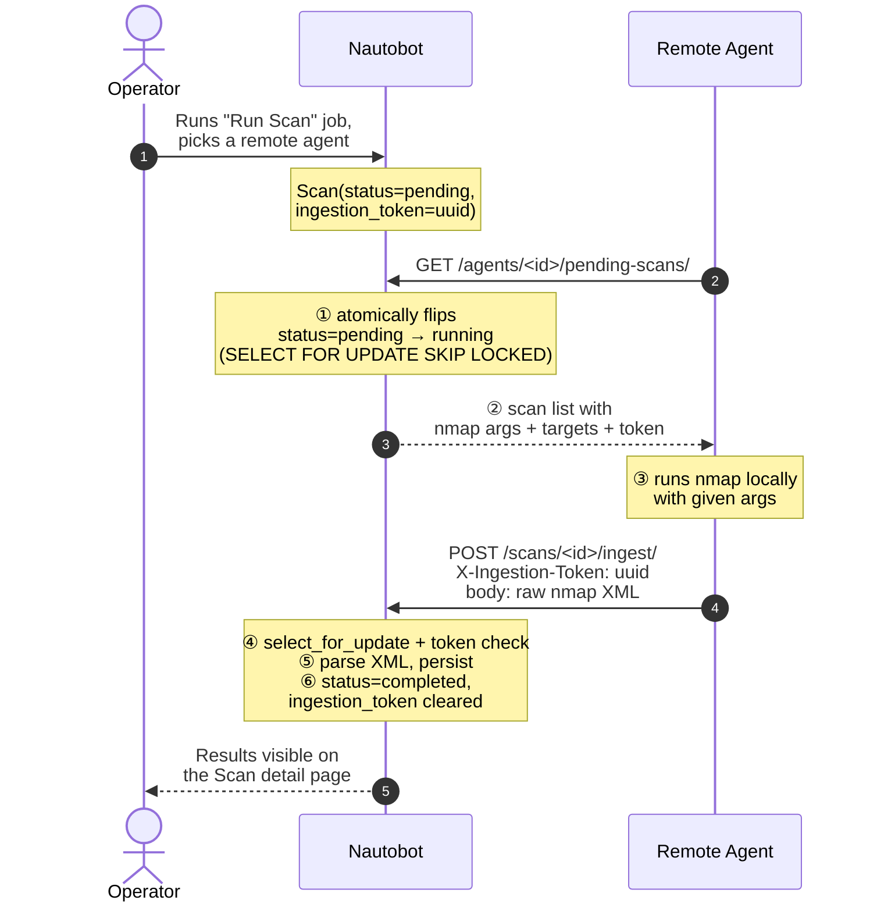

# Scanner Agent Protocol

The wire contract between `nautobot-app-scanner` and a remote agent. If
you can speak HTTP and run `nmap`, you can write a conforming agent in
any language — see [`agent/agent.py`](https://github.com/rsp2k/nautobot-app-scanner/blob/main/agent/agent.py)
for the reference Python implementation (~250 lines, standard library
only).

For *deploying* the reference agent, see
[Install Remote Agent](../admin/install_remote_agent.md). This page is
for people writing a custom agent.

## Lifecycle



## Authentication

All three endpoints require an HTTP `Authorization: Token <key>` header.
The token must belong to a `User` that is bound (via `OneToOneField`)
to a `ScannerAgent` with `agent_type=remote`. Plain Nautobot user
tokens won't work — they'll return `401`.

Tokens are auto-issued when a remote agent is created via Nautobot's
admin UI:

1. Scanner → Agents → Add → fill in name, set `Agent Type = Remote`, Save.
2. The signal handler auto-creates a User named `scanner-agent-<slug>`.
3. Visit the User detail page (linked from the agent) and create a Token.

## Endpoints

Base URL: `{nautobot_base}/api/plugins/scanner/`

---

### `GET /agents/<uuid>/pending-scans/`

Polls for scans assigned to this agent that are waiting to be picked up.

**Atomic side effect**: every scan returned is transitioned
`pending → running` *inside the same transaction* that selects them, so
two pollers (or two pollers from the same agent racing each other)
can't both pick up the same scan. `SELECT ... FOR UPDATE SKIP LOCKED`
handles the concurrent case.

**Request**

```http
GET /api/plugins/scanner/agents/12c69f09-ea56-4fff-8c55-13bd6d53c065/pending-scans/
Authorization: Token <key>
```

**Response 200**

```json
[
  {
    "id": "f89f3738-7394-4eba-bd7f-be216ee18d40",
    "ingestion_token": "a4c8b1d2-e9f4-4a5b-9c7d-3e2f1a8b5c6d",
    "profile": {
      "name": "version-scan",
      "scan_type": "version",
      "nmap_arguments": "-sV --top-ports 100",
      "timing_template": "T4",
      "enabled_scripts": []
    },
    "targets": {
      "prefixes": ["10.128.144.0/24"],
      "ipaddresses": []
    }
  }
]
```

Empty array means "no work". Poll again later.

**Errors**

| Status | Cause |
|---|---|
| `401` | Token missing or invalid |
| `403` | Token belongs to a different agent than the one in the URL |
| `404` | Agent UUID doesn't exist (or isn't `agent_type=remote`) |

---

### `POST /scans/<uuid>/ingest/`

Uploads tool output (nmap XML, dig text, masscan JSON, …) for a
previously-picked-up scan. The server dispatches to the parser
registered for the tool, materializes
`DiscoveredHost` / `DiscoveredPort` / `NseFinding` /
`TraceRouteHop` records, gzips the raw output to storage, and
transitions the scan to `completed`.

**Critical**: the `X-Ingestion-Token` header must match the
`ingestion_token` you received from `/pending-scans/`. The server clears
the token on successful ingest, so a second POST with the same token
gets `403`. This is the retry-after-504 defense — a network blip
between you and Nautobot won't cause double-insertion of host records.

**Multi-tool dispatch (Phase G).** The `X-Tool` request header tells
the server which parser to invoke (`nmap` / `dig` / `masscan` / …).
Omitting `X-Tool` defaults to `nmap` for back-compat with pre-Phase-G
agents. Non-nmap output goes into `Scan.raw_output` (gzipped) instead
of `Scan.raw_xml`. See [ADR-013](architecture.md#adr-013-pluggable-parser-dispatch-multi-tool-agent-foundation)
for the dispatch design.

**Request (nmap)**

```http
POST /api/plugins/scanner/scans/f89f3738-7394-4eba-bd7f-be216ee18d40/ingest/
Authorization: Token <key>
Content-Type: application/xml
X-Ingestion-Token: a4c8b1d2-e9f4-4a5b-9c7d-3e2f1a8b5c6d
X-Tool: nmap

<?xml version="1.0" encoding="UTF-8"?>
<nmaprun ...>
  ...
</nmaprun>
```

**Request (dig)** — the same endpoint, different headers + body:

```http
POST /api/plugins/scanner/scans/981f26d0-aaaa-bbbb-cccc-ddddeeeeffff/ingest/
Authorization: Token <key>
Content-Type: text/plain
X-Ingestion-Token: 7b9c8d1e-2f3a-4b5c-9d8e-1a2b3c4d5e6f
X-Tool: dig

example.com. 3600 IN A 93.184.216.34
example.com. 3600 IN MX 0 .
```

**Response 200**

```json
{
  "scan_id": "f89f3738-7394-4eba-bd7f-be216ee18d40",
  "status": "completed",
  "summary": {
    "hosts_up": 256,
    "hosts_down": 0,
    "ports_open": 11,
    "vulnerabilities": 0,
    "traceroute_hops": 0
  }
}
```

**Errors**

| Status | Cause |
|---|---|
| `400` | Missing/malformed `X-Ingestion-Token`, unrecognized `X-Tool` value, or unparseable body for the chosen tool |
| `401` | Token missing or invalid |
| `403` | Token-agent doesn't own this scan; OR token has already been consumed (replay) |
| `404` | Scan UUID doesn't exist |
| `409` | Scan is in a state that can't accept ingest (e.g. `cancelled`) |

---

### `POST /agents/<uuid>/checkin/`

Heartbeat. Updates `last_seen` (mandatory) and optionally `version` and
`capabilities` if the agent wants to publish them.

**Request**

```http
POST /api/plugins/scanner/agents/12c69f09-ea56-4fff-8c55-13bd6d53c065/checkin/
Authorization: Token <key>
Content-Type: application/json

{
  "version": "reference-agent/1.0",
  "capabilities": {
    "nmap_version": "Nmap version 7.94 ( https://nmap.org )",
    "hostname": "dmz-jumpbox"
  }
}
```

Both `version` and `capabilities` are optional. A bare empty `{}` is
valid and just bumps `last_seen`.

**Response 200**

```json
{
  "agent_id": "12c69f09-ea56-4fff-8c55-13bd6d53c065",
  "last_seen": "2026-05-24T23:59:01.123456Z",
  "version": "reference-agent/1.0",
  "capabilities": {...}
}
```

Recommended cadence: every 60 seconds. The server-side `Mark Stale
Agents Offline` Job flips agents to status `Offline` when `last_seen >
3 × CHECKIN_INTERVAL_SECONDS` ago (default threshold: 180 seconds).

## Building your own agent

Minimal pseudocode:

```python
while True:
    scans = http_get(f"{base}/agents/{agent_id}/pending-scans/", token)
    for scan in scans:
        argv = ["nmap", "-oX", "-"] + scan["profile"]["nmap_arguments"].split() \
             + [f"-{scan['profile']['timing_template']}"] \
             + scan["targets"]["prefixes"] + scan["targets"]["ipaddresses"]
        xml = subprocess.run(argv, capture_output=True, text=True).stdout
        http_post(
            f"{base}/scans/{scan['id']}/ingest/",
            body=xml,
            headers={"X-Ingestion-Token": scan["ingestion_token"]},
            token=token,
        )
    sleep(POLL_INTERVAL)
```

Background thread does `POST /checkin/` every `CHECKIN_INTERVAL`. That's
the whole protocol. The reference agent is ~250 lines because it adds
TLS opts, error handling, signal traps, capability probing, and
configuration loading — none of which are protocol requirements.
