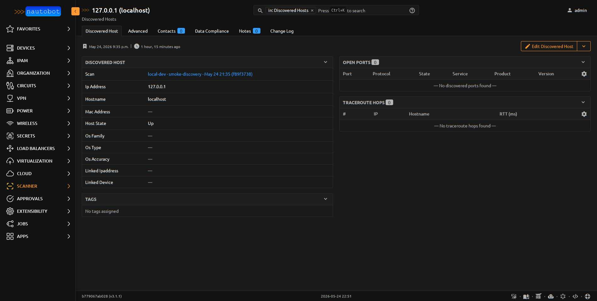

# DiscoveredHost

One host nmap reported during a scan. Identity is `(scan, ip_address)`
— the same IP discovered across multiple scans yields multiple rows so
historical per-scan state is preserved.

<figure markdown>

<figcaption>DiscoveredHost detail — the BaseModel child records (Open Ports, Traceroute Hops) render as nested tables on the host's own page.</figcaption>
</figure>

| Field | Description |
|-------|-------------|
| `scan` | FK to `Scan` (CASCADE) |
| `ip_address` | `VarbinaryIPField` (db_indexed) — IPv4 or IPv6 as reported by nmap |
| `mac_address` | CharField(17) — L2 MAC if nmap resolved it (ARP for v4, NDP for v6) |
| `hostname` | CharField |
| `os_family` | CharField — high-level OS guess (Linux, Windows, BSD) from `-O` |
| `os_type` | CharField — specific OS string (e.g. `Linux 5.x`, `Windows Server 2019`) |
| `os_accuracy` | PositiveSmallIntegerField (0-100) — nmap's `accuracy` attribute |
| `host_state` | CharField (choices=`HostStateChoices`, db_indexed) — `up` / `down` / `unknown` / `skipped` |
| `linked_ipaddress` | FK to `ipam.IPAddress` (SET_NULL, db_indexed) — populated by the **Promote to IPAddress** action |
| `linked_device` | FK to `dcim.Device` (SET_NULL, db_indexed) — auto-resolved at ingest by matching IP against `Device.primary_ip4/6` |

**Base class:** `PrimaryModel`.

**`@extras_features`:** custom_fields, custom_links, custom_validators,
export_templates, graphql, relationships, webhooks.

## Unique constraint

`(scan, ip_address)` — one host per scan.

## Indexes

- `(ip_address, host_state)` — fast "what's up at this IP across history"

## Important relationships

| Direction | Field | Target |
|-----------|-------|--------|
| FK out | `scan` | `Scan` |
| FK out | `linked_ipaddress` | `ipam.IPAddress` (set by Promote action) |
| FK out | `linked_device` | `dcim.Device` (auto-resolved at ingest) |
| Reverse FK | `ports` | `DiscoveredPort` |
| Reverse FK | `traceroute_hops` | `TraceRouteHop` |

## Promote action

A DiscoveredHost can be promoted to a real `ipam.IPAddress` via the
**Promote to IPAddress** action — see [Promote to IPAddress](../user/promotion.md).
The action checks `ipam.add_ipaddress` permission and sets
`linked_ipaddress` on the discovered host to the newly-created
IPAddress.

## See also

- [App Overview](../user/app_overview.md)
- [Promote to IPAddress](../user/promotion.md)

::: nautobot_scanner.models.DiscoveredHost
    options:
      show_root_heading: false
