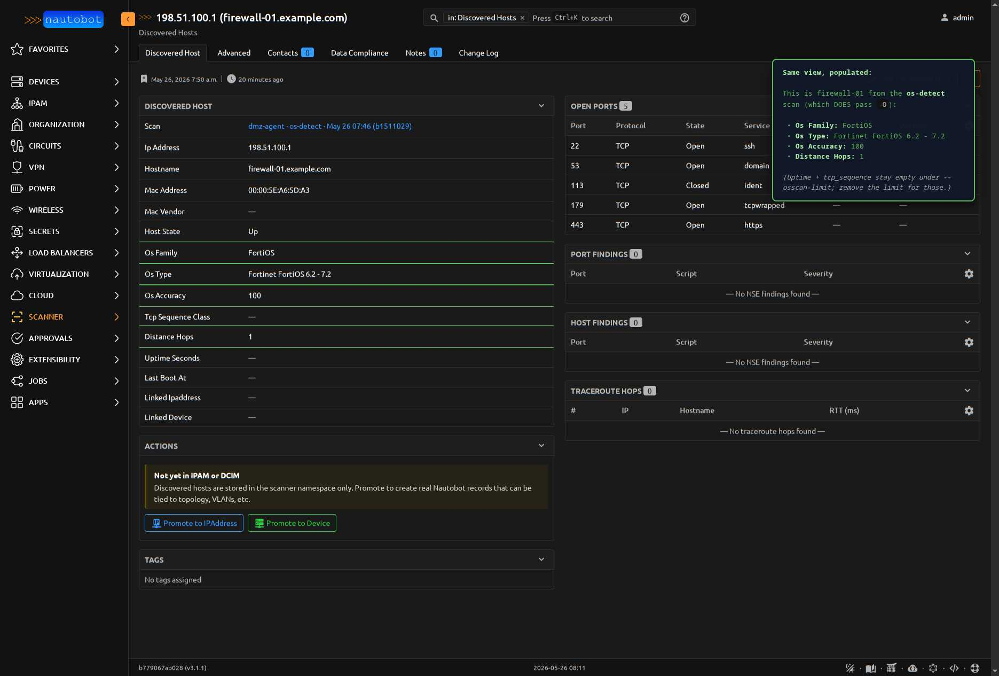
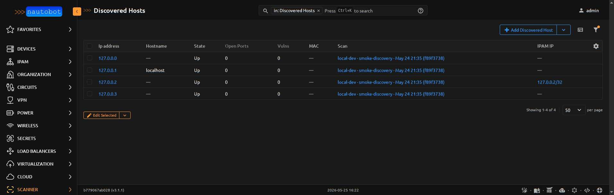

# DiscoveredHost

One host nmap reported during a scan. Identity is `(scan, ip_address)`
— the same IP discovered across multiple scans yields multiple rows so
historical per-scan state is preserved.

<figure markdown>

<figcaption>DiscoveredHost detail after a `vuln` profile scan. Left column: host fields + the **Actions** panel with Promote-to-IPAddress / Promote-to-Device buttons. Right column: nested tables for Open Ports (6 services), Vulnerabilities (3 Critical `vulners` + 3 Informational `http-server-header`), and Traceroute Hops. IP and hostname are sanitized to RFC-5737 / `.example.com` placeholders.</figcaption>
</figure>

| Field | Description |
|-------|-------------|
| `scan` | FK to `Scan` (CASCADE) |
| `ip_address` | `VarbinaryIPField` (db_indexed) — IPv4 or IPv6 as reported by nmap |
| `mac_address` | CharField(17) — L2 MAC if nmap resolved it (ARP for v4, NDP for v6) |
| `mac_vendor` | CharField(128, db_indexed) — IEEE-registered manufacturer resolved from the MAC's OUI via `netaddr`'s bundled registry. Filled at ingest; empty when `mac_address` is blank or the OUI isn't in the registry (typically locally-administered VM/container MACs). |
| `hostname` | CharField |
| `os_family` | CharField — high-level OS guess (Linux, Windows, BSD) from `-O` |
| `os_type` | CharField — specific OS string (e.g. `Linux 5.x`, `Windows Server 2019`) |
| `os_accuracy` | PositiveSmallIntegerField (0-100) — nmap's `accuracy` attribute |
| `host_state` | CharField (choices=`HostStateChoices`, db_indexed) — `up` / `down` / `unknown` / `skipped` |
| `linked_ipaddress` | FK to `ipam.IPAddress` (SET_NULL, db_indexed) — populated by the **Promote to IPAddress** action |
| `linked_device` | FK to `dcim.Device` (SET_NULL, db_indexed) — auto-resolved at ingest by matching IP against `Device.primary_ip4/6` |
| `valid_during` | DateTimeRangeField (nullable) — *wire time*: the window during which nmap actually observed this host. Typically `[scan.started_at, scan.completed_at]`. NULL for legacy/malformed rows. |
| `recorded_during` | DateTimeRangeField (required, defaults to `[now(), ∞)`) — *belief time*: when scanner-app believed this row was the current state of `(scan, ip)`. Upper bound closes when a re-parse supersedes the row. |
| `entry_id` | UUIDField (db_indexed, default=`uuid4`) — distinguishes successive beliefs about the same `(scan, ip)` observation. |
| `distance_hops` | PositiveSmallIntegerField (nullable) — network hops to this host, from ping/traceroute. Matches `len(traceroute_hops)` when an `-O` + traceroute scan ran. |
| `uptime_seconds` | PositiveBigIntegerField (nullable) — seconds since last boot, derived by nmap from TCP timestamps during `-O`. Populated when nmap can read TCP timestamps off at least one open port. |
| `last_boot_at` | DateTimeField (nullable, db_indexed) — absolute boot timestamp = `scan.completed_at - uptime_seconds`. Stored materialized so filters like *"hosts that rebooted in the last hour"* work without subtracting at query time. |
| `tcp_sequence_class` | CharField(64) — TCP ISN classification from `-O` (e.g. `random positive increments`, `trivial time dependency`). OS-family signal independent of `os_family` — useful when `-O` returns a low-confidence fingerprint but the ISN class is clearly Linux-style vs Windows-style. |
| `os_vendor` | CharField(64, db_indexed) — OS vendor from nmap's `osclass` (`Microsoft`, `Apple`, `Linux`, `Cisco`, `Fortinet`, …). Filterable column for "show me everything Microsoft makes." |
| `os_device_type` | CharField(32, db_indexed) — device class from nmap's `osclass` `type` attribute: `general purpose`, `router`, `printer`, `firewall`, `switch`, `storage-misc`, `webcam`, etc. Powers the "show me all printers" filter without parsing `os_type` strings. |
| `os_gen` | CharField(32) — OS generation/version string from nmap's `osclass` `osgen` (e.g. `10`, `7`, `2.4.X`). Coarser than `os_type` — useful for rolling up "Windows 10 family" without caring which specific build. |
| `os_cpe` | JSONField (list of strings) — CPE strings nmap associates with the OS match (e.g. `['cpe:/o:microsoft:windows_10']`). The **bridge to CVE databases** — feed these into your vuln-tracking system to correlate OS-level CVEs. |
| `os_alternative_matches` | JSONField (list of dicts) — alternative OS guesses beyond the top match, as `[{'name': str, 'accuracy': int}, ...]`. Tells operators whether the top guess was 95% top / 92% next (close call worth eyeballing) vs 90% top / 50% next (clear winner). |
| `hostnames` | JSONField (list of strings) — full list of hostnames nmap reported (PTR records + user-supplied). The denormalized first entry stays in `hostname` for table-cell display; this carries the rest. Useful when a host has multiple PTRs (`device1.example.com`, `mgmt.device1.example.com`). |
| `ip_sequence_class` | CharField(64) — IP ID sequence class from nmap's IP-sequence-prediction step (e.g. `All zeros`, `Incremental`, `Randomized`). OS-fingerprinting signal complementary to `tcp_sequence_class` — same row purpose, different probe surface. |
| `extraports` | JSONField (dict) — nmap's "extraports" summary: when most scanned ports share one state (`Not shown: 997 filtered tcp ports`), nmap collapses them rather than emitting 997 individual rows. Shape: `{state, count, reasons: [{reason, count}, ...]}`. Lets you know "997 filtered" without 997 `DiscoveredPort` rows polluting the host detail page. |

<figure markdown>

<figcaption>The same panel layout from the [NseFinding host-scope demo](nsefinding.md#port-scope-vs-host-scope), but from an `os-detect` scan where the `-O` probes actually ran. `firewall-01` (a FortiGate) yields **Os Family** = FortiOS, **Os Type** = Fortinet FortiOS 6.2 - 7.2, **Os Accuracy** = 100 (perfect match), **Distance Hops** = 1. The annotation notes that `Uptime Seconds` + `Tcp Sequence Class` stay empty under `--osscan-limit` — drop that flag to populate them.</figcaption>
</figure>

**Base class:** `PrimaryModel`.

**`@extras_features`:** custom_fields, custom_links, custom_validators,
export_templates, graphql, relationships, webhooks.

## Unique constraint

`(scan, ip_address)` — *partial* unique index, enforced only on rows
where `recorded_during__upper IS NULL` (the currently-held belief).
Multiple historical-belief rows for the same `(scan, ip)` are expected
and supported, distinguished by `entry_id`. The partial-unique pattern
was chosen over PostgreSQL `ExclusionConstraint` because the only
failure mode that actually arises is "two CURRENT beliefs collide on
insert" — amendment paths always close the prior belief atomically,
so overlapping belief windows would only arise from buggy amendments,
which the simpler partial unique catches at insert time anyway.

## Bitemporality

The model carries two independent time dimensions — this is the
"tier-4" bitemporal pattern, modeled after l2trace.warehack.ing.

| Axis | Field | What it means |
|------|-------|---------------|
| **Valid time** (wire time) | `valid_during` | When nmap actually observed this host — typically the parent scan's `[started_at, completed_at]` window. |
| **Recorded time** (belief time) | `recorded_during` | When scanner-app believed this row was the current state of `(scan, ip)`. `[ingest_time, ∞)` while it's the current belief; `[ingest_time, supersede_time)` after a re-parse closes it. |

Re-parsing an old scan after a parser bugfix doesn't destroy the prior
belief — it closes the old row's `recorded_during` window and inserts
a new row with a fresh `entry_id` and an open-ended `recorded_during`.
The diff view's `?as_of=<datetime>` hook (machinery exists; UI surface
deferred) reproduces past beliefs by filtering on this axis.

### QuerySet helpers

The default manager returns **all rows including superseded beliefs** —
this matches Django's `manager.all() returns all rows` contract, which
Nautobot internals (admin, serializers, list viewsets) rely on. Three
chainable methods scope by time:

| Method | Returns |
|--------|---------|
| `.current()` | Rows whose `recorded_during` contains `now()` — i.e., the currently-held belief about each `(scan, ip)`. The default for user-facing list views. |
| `.as_of(dt)` | Rows whose `recorded_during` contains the given recorded-time `dt`. Replays "what we believed at time T." |
| `.for_wire_time(dt)` | Rows whose `valid_during` contains the given wire-time `dt`. Returns ALL beliefs (current + historical) for any observation that included `dt`; chain with `.current()` or `.as_of(T)` to scope by recording-time. |

```python
from nautobot_scanner.models import DiscoveredHost
from django.utils import timezone

# Current belief about every host across all scans
DiscoveredHost.objects.current()

# What did we believe at the start of last quarter
DiscoveredHost.objects.as_of(timezone.datetime(2026, 1, 1))

# Every host that was observed at 2:30am UTC today, all beliefs
DiscoveredHost.objects.for_wire_time(timezone.datetime(2026, 5, 26, 2, 30))
```

## Indexes

- `(ip_address, host_state)` — fast "what's up at this IP across history"

## Important relationships

| Direction | Field | Target |
|-----------|-------|--------|
| FK out | `scan` | `Scan` |
| FK out | `linked_ipaddress` | `ipam.IPAddress` (set by Promote action) |
| FK out | `linked_device` | `dcim.Device` (auto-resolved at ingest) |
| Reverse FK | `ports` | `DiscoveredPort` |
| Reverse FK | `traceroute_hops` | `TraceRouteHop` |
| Reverse FK | `host_findings` | `NseFinding` (host-scope NSE script output — direct `discovered_host` FK; rendered as the **Host Findings** panel on the host detail page) |
| Reverse two-hop | `ports.vulnerabilities` | `NseFinding` (per-port NSE script output — rendered as the **Port Findings** panel via `discovered_port__discovered_host` table filter) |

## Computed properties

| Property | Returns |
|---|---|
| `open_port_count` | Number of `DiscoveredPort` rows on this host where `state="open"`. Reads from `_open_port_count` if the queryset was annotated (the list view does this to avoid N+1), otherwise falls back to a per-row count query. |
| `vulnerability_count` | Total `NseFinding` rows on this host, summing **both** port-scope (via `ports.vulnerabilities`) and host-scope (direct `host_findings`). Same annotation-or-fallback pattern — the list view annotates `_vulnerability_count` with a combined count so the column stays accurate without per-row queries. |

Both properties power the badges on the scanner panels embedded in
Device / IPAddress / Prefix detail pages — using `_count` annotations
keeps those panels fast even when a Device has many associated
DiscoveredHosts.

<figure markdown>

<figcaption>The DH list view's **Open Ports** and **Vulns** columns are populated from the same `_open_port_count` / `_vulnerability_count` annotations — `select_related("scan")` plus the count annotation keeps the page to two queries regardless of row count.</figcaption>
</figure>

## Promote actions

A DiscoveredHost can be promoted to a real `ipam.IPAddress` (lightweight,
permission: `ipam.add_ipaddress`) or to a full `dcim.Device` + Interface
+ IPAddress (heavier, requires `dcim.add_device` + `dcim.add_interface`
+ `ipam.add_ipaddress`). See [Promote a Discovered Host](../user/promotion.md)
for both flows.

## Rescan this host

The DiscoveredHost detail page also has a **Rescan this host** action
that dispatches a fresh single-host scan against this host's
`ip_address`. The new scan inherits the **agent + profile** from the
host's parent scan, so the rescan exercises exactly the same code
path the original did — making the resulting [scan diff](../user/scan_diff.md)
immediately useful as a "what changed on this host in the last N
minutes?" check.

Operationally:

- **Bitemporally additive.** A rescan creates *new* DiscoveredHost
  rows with their own `recorded_during` windows — prior beliefs stay
  queryable via `.as_of(<earlier time>)`. Nothing is overwritten.
- **No IPAM commitment.** The new scan uses
  [`Scan.target_raw_ips`](scan.md) (a JSONField of bare IP strings,
  added in migration `0011` specifically for this case) instead of
  `target_ipaddresses` M2M. Bypasses IPAM entirely so the rescan
  works identically whether the host has been promoted yet or not.
- **Permission**: `nautobot_scanner.change_discoveredhost` —
  rescanning is a "read fresher data about this host" action, not an
  IPAM/DCIM mutation. POST-only (`POST /plugins/scanner/discovered-hosts/<pk>/rescan/`).

## See also

- [App Overview](../user/app_overview.md)
- [Promote to IPAddress](../user/promotion.md)
- [Comparing Scans](../user/scan_diff.md) — uses `.as_of()` to anchor diffs at a specific belief time

::: nautobot_scanner.models.DiscoveredHost
    options:
      show_root_heading: false
