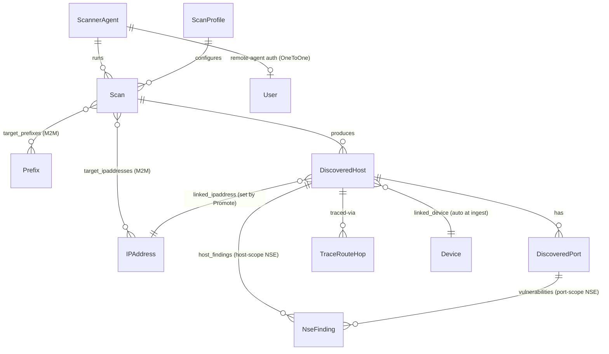

# Data Models

The app defines 7 models grouped into three concerns. Click into any
model for field-level reference.

## Identity

| Model | Base | Purpose |
|-------|------|---------|
| [`ScannerAgent`](scanneragent.md) | `PrimaryModel` | Who runs scans (local vs remote) |
| [`ScanProfile`](scanprofile.md) | `PrimaryModel` | Reusable nmap argument template |

## Execution

| Model | Base | Purpose |
|-------|------|---------|
| [`Scan`](scan.md) | `PrimaryModel` | One scan execution + lifecycle + raw XML |

## Results

| Model | Base | Purpose |
|-------|------|---------|
| [`DiscoveredHost`](discoveredhost.md) | `PrimaryModel` | One host nmap reported |
| [`DiscoveredPort`](discoveredport.md) | `BaseModel` | One port on a discovered host |
| [`NseFinding`](nsefinding.md) | `BaseModel` | One NSE finding on a port |
| [`TraceRouteHop`](traceroutehop.md) | `BaseModel` | One hop in a host's traceroute path |

## Relationship diagram

Notation summary (mermaid erDiagram crow's-foot):

- `||--o{` — one-to-many (parent on left, children on right)
- `}o--o{` — many-to-many (M2M tables)
- `}o--||` — many-to-one (FK on the many side)
- `||--o|` — one-to-zero-or-one (nullable OneToOne)

`Prefix` / `IPAddress` / `Device` / `User` are Nautobot's own models;
the rest are this app's. The two `NseFinding` relationships are the
[port-OR-host scope generalization](nsefinding.md#port-scope-vs-host-scope)
shipped in migration `0009` — exactly one is set per finding row,
enforced by a `CheckConstraint` at the schema level.

## Base class choices

| Concern | Choice | Reason |
|---------|--------|--------|
| Anything that gets its own UI page | `PrimaryModel` | Status, tags, change-log, custom fields, GraphQL |
| Child records rendered nested in parent | `BaseModel` | Lightweight (UUID PK only); not bloated with status/tags |

See [Architecture Decisions](../dev/architecture.md) for the
reasoning behind these choices.
