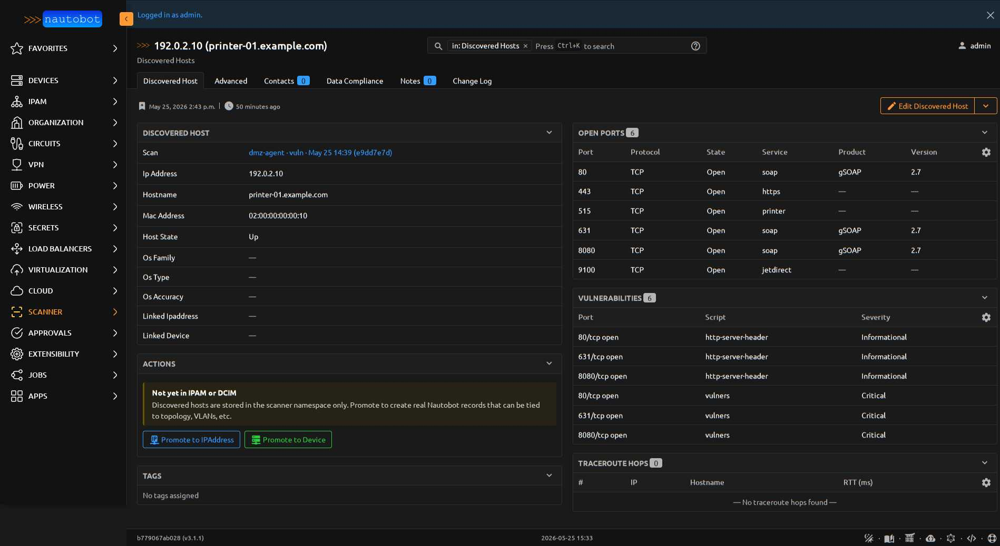

# NseFinding

One vulnerability or interesting NSE-script output for a
`DiscoveredPort`.

<figure markdown>

<figcaption>NseFinding rows surface as a nested panel on the parent `DiscoveredHost` detail page. Each row shows the producing NSE script, severity badge, and a truncated output preview — click into the row for the full output and references list.</figcaption>
</figure>

| Field | Description |
|-------|-------------|
| `discovered_port` | FK to `DiscoveredPort` (CASCADE) |
| `nse_script` | CharField — name of the NSE script that produced the finding (e.g. `vulners`, `ssl-cert`, `http-title`) |
| `output` | TextField — raw script output (may contain CVE IDs, CVSS scores, exploit URLs) |
| `severity` | CharField (choices=`SeverityChoices`, db_indexed) — `unknown` / `info` / `low` / `medium` / `high` / `critical`. Default `unknown` — **never null** |
| `references` | JSONField (list) — parsed reference URLs (CVE links, exploit-db entries, vendor advisories) |

**Base class:** `BaseModel` (lightweight — no status/tags/change-log).

## Severity defaulting

`severity` defaults to `unknown` and is never null. This means filter
and table code never has to branch on missing values — there's always
a usable severity to render.

The parser populates severity by:

1. Reading `cvss` attributes from `vulners` script output where
   present
2. Mapping severity keywords found in script output (`CRITICAL`,
   `HIGH`, etc.)
3. Falling back to `unknown` if neither yields a value

## Important relationships

| Direction | Field | Target |
|-----------|-------|--------|
| FK out | `discovered_port` | `DiscoveredPort` |

::: nautobot_scanner.models.NseFinding
    options:
      show_root_heading: false
