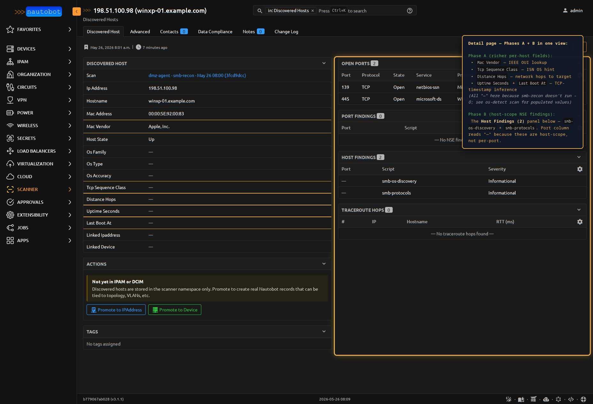

# NseFinding

One NSE-script finding — vulnerability **or** informational — from a
scan. Attaches to either a `DiscoveredPort` (per-port scripts) or a
`DiscoveredHost` (host-scope scripts), but never both.

Renamed from `VulnerabilityFinding` in migration `0009`. The original
name implied this model only stored CVE-bearing data, but nmap's NSE
catalog produces a lot of informational output too — `ssl-cert`,
`http-title`, `smb-os-discovery`, `snmp-info` — that has no CVE
attached. The `severity` field is what actually distinguishes
"vulnerability" from "interesting fact." See
[ADR-012](../dev/architecture.md#adr-012-generalize-finding-model-from-port-scope-only-to-port-or-host-scope).

<figure markdown>

<figcaption>NseFinding rows surface as nested panels on the parent `DiscoveredHost` detail page — one panel for per-port findings (via two-hop reverse FK), one for host-scope findings (via direct reverse FK). Each row shows the producing NSE script, severity badge, and a truncated output preview.</figcaption>
</figure>

| Field | Description |
|-------|-------------|
| `discovered_port` | FK to `DiscoveredPort` (CASCADE, nullable). Set when this finding came from a per-port NSE script (`vulners`, `ssl-cert`, `http-title`). **Mutually exclusive with `discovered_host`.** |
| `discovered_host` | FK to `DiscoveredHost` (CASCADE, nullable). Set when this finding came from a host-scope NSE script (`smb-os-discovery`, `snmp-info`, `ssh-hostkey`). **Mutually exclusive with `discovered_port`.** |
| `nse_script` | CharField(128) — name of the NSE script that produced the finding |
| `output` | TextField — raw script output. May contain CVE IDs, CVSS scores, exploit URLs, or just informational data depending on the script. |
| `severity` | CharField (choices=`SeverityChoices`, db_indexed) — `unknown` / `info` / `low` / `medium` / `high` / `critical`. Default `unknown` — **never null**. |
| `references` | JSONField (list) — parsed reference URLs (CVE links, exploit-db entries, vendor advisories). |

**Base class:** `BaseModel` (lightweight — no status/tags/change-log).

**Default ordering:** `-severity, nse_script` — critical findings
surface at the top of every queryset by default.

## Port-scope vs host-scope

nmap's NSE engine runs scripts in two different scopes:

| Scope | Examples | Anchored to |
|-------|----------|-------------|
| **Per-port** | `vulners`, `ssl-cert`, `ssl-enum-ciphers`, `http-title`, `http-headers`, `http-server-header` | A specific `DiscoveredPort` — fires per-port-per-host |
| **Host-scope** | `smb-os-discovery`, `smb-protocols`, `snmp-info`, `snmp-sysdescr`, `ssh-hostkey`, `ssh-auth-methods` | A `DiscoveredHost` directly — fires once per host even when the underlying service spans multiple ports |

Pre-`0009` (when this model required a `discovered_port`), host-scope
NSE output was **silently dropped** by the parser — `smb-os-discovery`
results never landed anywhere. The schema change adds the
`discovered_host` FK so those findings persist, and the parser's
`_convert_host` now pulls `nmap_host.scripts_results` alongside the
per-port iteration.

<figure markdown>

<figcaption>A `winxp-01` host detail page after an `smb-recon` scan. The split is visible: **Port Findings** is empty (smb-recon's NSE scripts are host-scope, not per-port), while **Host Findings** carries the two `Informational` rows (`smb-os-discovery` and `smb-protocols`) attached via the direct `discovered_host` FK. The Phase-A fields panel on the left reads `—` for `Mac Vendor` / `Tcp Sequence Class` / `Distance Hops` / `Uptime Seconds` / `Last Boot At` because `smb-recon` doesn't run `-O`; see [DiscoveredHost](discoveredhost.md) for what populates them.</figcaption>
</figure>

## Constraint: exactly one parent

A `CheckConstraint` named `nsefinding_exactly_one_parent` enforces at
the database level that exactly one of `discovered_port` or
`discovered_host` is set per row:

```sql
CHECK (
    (discovered_port_id IS NOT NULL AND discovered_host_id IS NULL)
 OR (discovered_port_id IS NULL     AND discovered_host_id IS NOT NULL)
)
```

The XOR constraint is at the schema level (not just enforced in
`clean()`) so it survives:

- Bulk inserts that skip model validation (`bulk_create`)
- Raw SQL or ORM-bypass writes
- Buggy parser changes that set both FKs or neither

Attempting `NseFinding.objects.create(discovered_port=None,
discovered_host=None)` raises `IntegrityError` rather than producing
an orphan row.

## Severity defaulting

`severity` defaults to `unknown` and is never null. Filter and table
code never has to branch on missing values — there's always a usable
severity to render.

The parser populates severity in this order:

1. Reading `cvss` attributes from `vulners` script output where present
2. Mapping severity keywords found in script output (`CRITICAL`, `HIGH`, etc.)
3. Falling back to `unknown` if neither yields a value

## Important relationships

| Direction | Field | Target |
|-----------|-------|--------|
| FK out *(nullable)* | `discovered_port` | `DiscoveredPort` — per-port scope |
| FK out *(nullable)* | `discovered_host` | `DiscoveredHost` — host-scope |

Reverse access:

| From | Reverse name | Returns |
|------|--------------|---------|
| `DiscoveredPort.vulnerabilities` | port-scope findings on that port |
| `DiscoveredHost.host_findings` | host-scope findings on that host (direct) |
| `DiscoveredHost.ports.vulnerabilities` | port-scope findings across all the host's ports (two-hop) |

The host detail page renders both as separate **Host Findings** and
**Port Findings** panels. `DiscoveredHost.vulnerability_count`
property sums across both scopes so the list view's **Vulns** column
stays accurate regardless of where the finding attached.

## See also

- [ADR-012](../dev/architecture.md#adr-012-generalize-finding-model-from-port-scope-only-to-port-or-host-scope) — design rationale
- [Scan Profiles](../user/scan_profiles.md) — the NSE-heavy profiles
  that exercise this model (`vuln`, `web-recon`, `tls-audit`,
  `smb-recon`, `snmp-recon`, `ssh-recon`)
- [DiscoveredPort](discoveredport.md)
- [DiscoveredHost](discoveredhost.md)

::: nautobot_scanner.models.NseFinding
    options:
      show_root_heading: false
