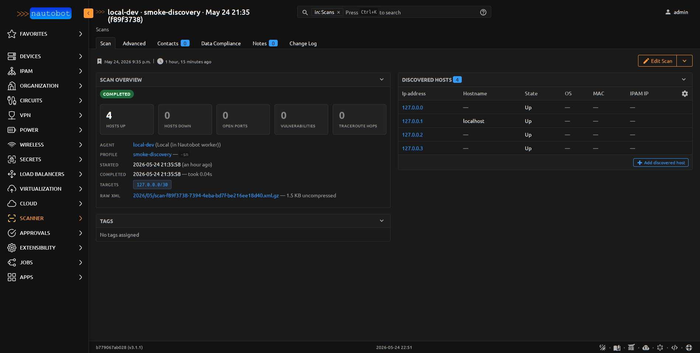
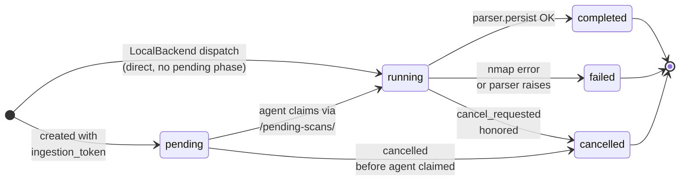

# Scan

One scan execution. Named `Scan` rather than `ScanJob` to avoid
colliding with Nautobot's `extras.jobs.Job` namespace.

<figure markdown>

<figcaption>Scan detail view — the custom template in `templates/inc/scan_overview.html` renders stat cards, agent/profile/target metadata, and the discovered-hosts table.</figcaption>
</figure>

| Field | Description |
|-------|-------------|
| `agent` | FK to `ScannerAgent` (PROTECT) — which agent ran / will run the scan |
| `profile` | FK to `ScanProfile` (PROTECT) — what nmap args |
| `target_prefixes` | M2M to `ipam.Prefix` — scan whole prefixes |
| `target_ipaddresses` | M2M to `ipam.IPAddress` — scan individual IPs |
| `target_raw_ips` | JSONField (list of strings, default `[]`) — raw IP/CIDR strings to scan that aren't IPAM-committed. Appended to the nmap target list alongside the M2M targets. Powers the [Rescan-this-host action](discoveredhost.md#rescan-this-host) without polluting IPAM with throw-away entries. |
| `status` | CharField (choices=`ScanStateChoices`, db_indexed) — `pending` / `running` / `completed` / `failed` / `cancelled` |
| `cancel_requested` | BooleanField — remote agents poll between hosts |
| `started_at` | DateTime, nullable |
| `completed_at` | DateTime, nullable |
| `summary` | JSONField — counts populated at ingest (hosts, ports, vulns) |
| `ingestion_token` | UUID (unique, nullable) — one-shot; required on POST `/ingest/`. Cleared after ingest |
| `raw_xml` | FileField — gzipped nmap XML stored under `media/scanner/xml/YYYY/MM/`. Only populated when `tool_used='nmap'` |
| `raw_xml_size` | PositiveIntegerField — uncompressed XML size in bytes |
| `tool_used` | CharField(24, db_indexed) — which probe tool produced this scan's output (`nmap`, `dig`, `masscan`, …). Stamped at ingest from the agent's `X-Tool` header. Empty for pre-Phase-G scans. |
| `raw_output` | FileField — gzipped non-XML output from non-nmap tools (dig text, masscan JSON, …) stored under `media/scanner/output/YYYY/MM/`. **Mutually exclusive with `raw_xml`**: nmap scans use `raw_xml`, everything else uses `raw_output`. |
| `raw_output_size` | PositiveIntegerField — uncompressed `raw_output` size in bytes |
| `was_pentest_mode` | BooleanField (db_indexed) — **stamped True at dispatch** when the chosen profile had any pentest-class flag set (decoys / fragmentation / idle scan / custom MTU / source-port). Persists forever per [ADR-014](../dev/architecture.md#adr-014-pentest-mode-permission-gating-immutable-audit-flag) — answers "was THIS scan a pentest run?" even after the profile is edited. |
| `job_result` | FK to `extras.JobResult` (SET_NULL) — back-link to dispatching Job run |
| `error_message` | TextField — populated when `status=failed` |

### Scan provenance (captured from nmap XML at ingest)

These four fields are populated by the parser reading the nmap XML's
`<nmaprun>` attributes. They make the audit trail one query away
instead of one shell pivot through the gzipped raw XML.

| Field | Description |
|-------|-------------|
| `nmap_command` | TextField — full nmap command-line as reported by the XML (provenance + reproduction). Reproduces what was actually run, including any flags the dispatcher merged in beyond `profile.nmap_arguments`. |
| `nmap_version` | CharField(32) — nmap binary version that produced this scan (e.g. `7.94`). Useful when correlating scan results to known nmap-version-specific behavior changes. |
| `xml_version` | CharField(16) — nmap XML schema version. Forensic value when parsers drift between nmap releases. |
| `ports_scanned` | PositiveIntegerField (nullable) — number of ports scanned per host as reported by nmap (the **denominator** for `summary.ports_open`). Distinguishes "scanned 1000, found 10 open" from "scanned 100, found 10 open" — same numerator, very different operational meaning. |

**Base class:** `PrimaryModel`.

**`@extras_features`:** custom_fields, custom_links, custom_validators,
export_templates, graphql, relationships, webhooks.

## Indexes

- `(agent, status)` — fast lookup of "what's running on agent X"
- `(status, started_at)` — fast lookup of "what's been running recently"

## Lifecycle

Same state machine the [App Overview lifecycle](../user/app_overview.md#scan-lifecycle)
diagram shows in vertical form — repeated here for the model reference
page so each model doc stands on its own.

The `ingestion_token` is generated at Scan creation (via the
field's `default=uuid.uuid4`) and cleared at the end of a successful
`POST /ingest/`. It is `unique=True` with `null=True`, which works in
Postgres because `NULL != NULL` for uniqueness — multiple completed
scans can all have null tokens.

## Race protection

Ingest is guarded by:

1. `select_for_update()` on the Scan row
2. `status="running"` filter — POST against a completed/cancelled scan
   gets 409
3. `ingestion_token=<posted>` filter — POST with wrong/expired token
   gets 409

See [ADR-005](../dev/architecture.md#adr-005-ingest-race-protection-one-shot-token-select_for_update).

## Computed properties

| Property | Returns |
|----------|---------|
| `duration_seconds` | Float — wall-clock duration of the scan, or `None` if not finished |

## On the Scan detail page

Beyond the basics (status, profile, targets, raw-XML download), the
custom Scan detail template renders:

- **Provenance card** — surfaces `nmap_command`, `nmap_version`, and
  `ports_scanned` so the "what did this scan actually do?" question
  has a visible answer
- **NSE findings panel** — rolls up every [`NseFinding`](nsefinding.md)
  across every discovered host on this scan (both port-scope and
  host-scope) into one filterable table, so the "what did the NSE
  scripts find?" question doesn't require drilling into each host
- **Compare with previous scan on \<agent\>** button — opens the
  [scan diff view](../user/scan_diff.md) against the previous
  completed scan on the same agent

## Important relationships

| Direction | Field | Target |
|-----------|-------|--------|
| FK out | `agent` | `ScannerAgent` |
| FK out | `profile` | `ScanProfile` |
| M2M out | `target_prefixes` | `ipam.Prefix` |
| M2M out | `target_ipaddresses` | `ipam.IPAddress` |
| FK out | `job_result` | `extras.JobResult` |
| Reverse FK | `hosts` | `DiscoveredHost` |

## See also

- [Running Scans user guide](../user/running_scans.md)

::: nautobot_scanner.models.Scan
    options:
      show_root_heading: false
