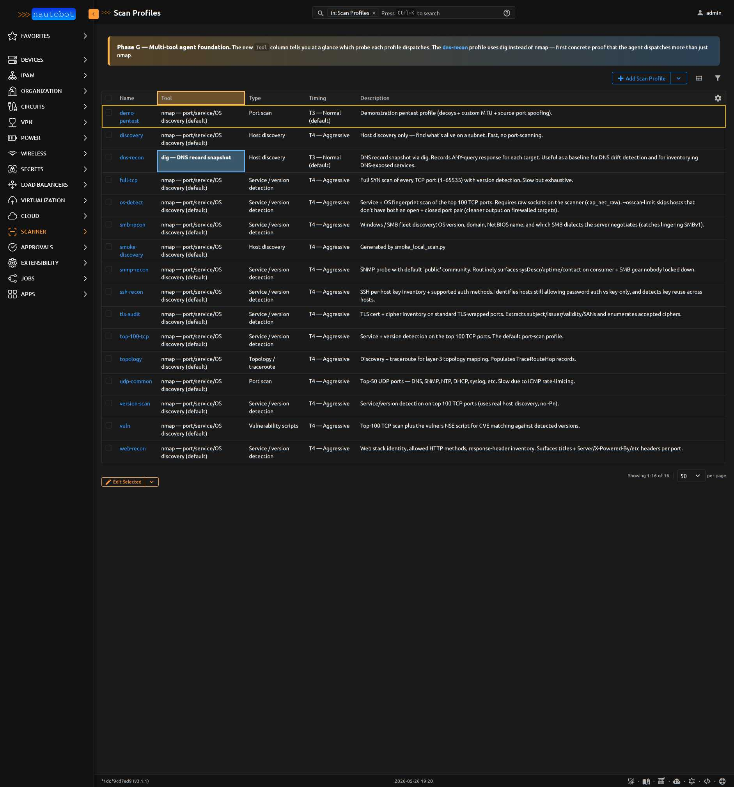

# ScanProfile

A reusable probe-tool argument template. Originally nmap-only;
[Phase G](../dev/architecture.md#adr-013-pluggable-parser-dispatch-multi-tool-agent-foundation)
generalized to any tool the agent image bundles. Operators pick a
profile by name when dispatching a scan; the backend dispatches the
right binary based on `tool` and uses `nmap_arguments` (when
`tool='nmap'`) or `tool_arguments` (everything else).

<figure markdown>

<figcaption>The ScanProfile list with the **Tool** column. Most profiles dispatch nmap (the default); `dns-recon` dispatches `dig`, `dnssec-trace` dispatches `drill`, and the four Phase-J profiles (`http-probe`, `path-baseline`, `masscan-sweep`, `tls-quick-check`) dispatch `curl` / `mtr` / `masscan` / `openssl-s_client` respectively. The `demo-pentest` and `masscan-sweep` rows render yellow — both are pentest-class.</figcaption>
</figure>

| Field | Description |
|-------|-------------|
| `name` | Unique identifier (operator-chosen, e.g. `discovery-fast`, `tcp-vuln-vulners`, `dns-recon`) |
| `scan_type` | Coarse classification — `discovery` / `port` / `version` / `vuln` / `topology`. Used for table filtering and panel decisions; the tool's argument string is the actual source of truth |
| `tool` | CharField(24, db_indexed) — which probe tool the agent runs: `nmap` (default), `dig`, `drill`, `curl`, `mtr`, `masscan`, `openssl-s_client`. Defaults to `nmap` so every pre-Phase-G seeded profile keeps working unchanged. The agent's startup capability probe reports which of these binaries the host actually has. |
| `nmap_arguments` | TextField — raw nmap flags (e.g. `-sS -sV --top-ports 1000`). Only used when `tool='nmap'`. DO NOT include target spec or `-oX` |
| `tool_arguments` | TextField — argument string for the chosen tool when it's **not** nmap. Examples: `dig` → `+noall +answer ANY`; `masscan` → `-p 0-65535 --rate=10000`. Target list is appended by the backend. |
| `timing_template` | `T0`..`T5` — paranoid through insane (nmap-specific; other tools ignore) |
| `enabled_scripts` | JSONField list of NSE script names — informational; you still have to include `--script <name>` in `nmap_arguments` to actually run them |
| `description` | Free-text |

### Pentest-mode fields (Phase I)

Five optional fields that each map to one nmap flag. **Setting any
one of them flips this profile into "pentest mode"** — dispatch then
requires the `nautobot_scanner.use_pentest_profiles` permission and
the resulting `Scan.was_pentest_mode` is stamped `True`. See
[Pentest Mode](../user/pentest_mode.md) for the legal-authorization
notice and operational gotchas.

| Field | nmap flag | Purpose |
|-------|-----------|---------|
| `decoy_addresses` | `-D <list>` | Comma-separated source-IP decoys; `ME` positions the agent's real IP in the list (e.g. `192.0.2.1,192.0.2.2,ME,192.0.2.3`) |
| `fragment_packets` | `-f` | Fragment outgoing packets to confuse simple IDS rules |
| `mtu` | `--mtu N` | Fragment with custom MTU (multiple of 8). Overrides `-f` when set |
| `source_port` | `--source-port N` | Spoof a specific source port for outgoing probes (53/88/443 are common bypasses) |
| `idle_scan_zombie` | `-sI <ip>` | Idle scan via a zombie host — all probes route through the zombie so the target sees the zombie as the attacker |

The `is_pentest_mode` computed property returns `True` when **either**
any of the five fields above is set, **or** `tool in PENTEST_TOOLS` —
the class-level frozenset that currently contains `{"masscan"}`. The
dispatch path queries this property rather than each input
individually, so adding new pentest-class tools (or new evasion fields)
is a one-line change without touching dispatch callers.

```python
# nautobot_scanner/models/agents.py
class ScanProfile(PrimaryModel):
    PENTEST_TOOLS = frozenset({"masscan"})

    @property
    def is_pentest_mode(self) -> bool:
        if self.tool in self.PENTEST_TOOLS:
            return True
        return bool(self.decoy_addresses or self.fragment_packets
                    or self.mtu or self.source_port or self.idle_scan_zombie)
```

**Natural key:** `name`.

**Base class:** `PrimaryModel`.

**`@extras_features`:** custom_fields, custom_links, custom_validators,
export_templates, graphql, relationships, webhooks.

## Important relationships

| Direction | Field | Target |
|-----------|-------|--------|
| Reverse FK | `scans` | `Scan` (one profile is used by many scans) |

## Permissions

| Permission | What it gates |
|---|---|
| Standard CRUD | `add_scanprofile`, `change_scanprofile`, `delete_scanprofile`, `view_scanprofile` |
| `nautobot_scanner.use_pentest_profiles` | **Dispatching** any profile where `is_pentest_mode == True`. Editing or viewing such profiles is unrestricted; only dispatch is gated. |

The split (view freely, dispatch with permission) is deliberate so
operators without dispatch authority can still audit which profiles
exist.

## See also

- [Scan Profiles user guide](../user/scan_profiles.md) — common recipes
- [Pentest Mode](../user/pentest_mode.md) — permission setup + legal notice for pentest-flagged profiles
- [ADR-013](../dev/architecture.md#adr-013-pluggable-parser-dispatch-multi-tool-agent-foundation) — why the parser/agent are multi-tool by dispatch dict
- [ADR-014](../dev/architecture.md#adr-014-pentest-mode-permission-gating-immutable-audit-flag) — why `was_pentest_mode` is stamped per-scan, not derived

::: nautobot_scanner.models.ScanProfile
    options:
      show_root_heading: false
