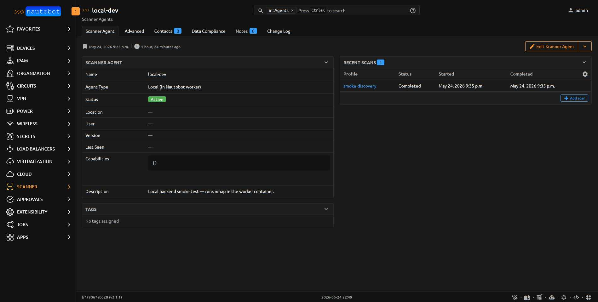

# Scanner Agents

A **ScannerAgent** is the identity of a scan executor. The `agent_type`
field selects between two execution models with very different
deployment characteristics.

<figure markdown>

<figcaption>An agent's detail page — fields on the left, recent scans on the right.</figcaption>
</figure>

## Local agents

`agent_type = local` means nmap runs inside the Nautobot Celery worker
process. The `LocalBackend` shells out to `subprocess.run(["nmap", ...])`,
captures the XML, and persists results synchronously.

**Use local agents when:**

- The Nautobot host (or its worker container) has L3 reachability to
  your scan targets
- You want the simplest possible deploy (one container, one binary)
- You're scanning a single network or a small number of related networks

**Don't use local agents when:**

- Your scan targets are in DMZ / OT / SCADA / branch / partner segments
  where the Nautobot host has no route
- You need to scan from a specific source IP that isn't the Nautobot
  host's IP
- You need scans to continue running across a Nautobot host restart
  (use Nautobot's job scheduling instead, but the worker still needs
  to be the one nmap'ing)

A local agent **does not need a `User` record**. The `user` field on
`ScannerAgent` is left null.

## Remote agents

`agent_type = remote` means nmap runs in a standalone Python agent
process deployed wherever it has reachability to the targets. The
`RemoteBackend` doesn't run nmap itself — it only flips the `Scan`
record to `pending` with a one-shot `ingestion_token`. The agent
polls a REST endpoint for assigned scans, executes them locally, and
POSTs the resulting XML back to Nautobot for parsing.

**Use remote agents when:**

- Scan targets are in network segments the Nautobot host can't reach
- You want scans to originate from a specific source IP / OS / nmap
  version (the agent host's)
- You need horizontal scaling (multiple agents in different segments)

### Authentication

Each remote `ScannerAgent` is bound to a dedicated `auth.User` (auto-
created via a signal when the agent is created). The DRF Token on that
user is the agent's bearer credential. **Show the token once** at agent
creation — it can't be retrieved later, only rotated.

This pattern (User + Token, not `extras.Secret`) is deliberate:

- `extras.Secret` is for Nautobot fetching credentials **outward** (vault, env, file)
- Agent auth is **inbound** — wrong direction of trust for `Secret`
- User + Token gives free audit-trail population (`created_by`, `last_updated_by`)
- Permission scoping works via standard Django groups

See [Agent Protocol](../dev/agent_protocol.md) for the REST contract a
custom agent must implement.

### Liveness and the offline marker

Remote agents are expected to check in periodically via
`POST /api/plugins/scanner/agents/<id>/checkin/`. The default interval
is 60 seconds (configurable via `PLUGINS_CONFIG['nautobot_scanner']['agent_checkin_interval_seconds']`).

A scheduled `MarkStaleAgents` Job (runs every 5 min by default) flips
the status of any agent whose `last_seen` is older than `3 ×
expected_interval` to `offline`. The Scanner Agent list view groups by
status so you can see at a glance which segments have lost their agent.

### Reference agent

A containerized reference agent ships in the
[`agent/`](https://git.supported.systems/nautobot-app-scanner/src/branch/main/agent)
directory of the repo. Same Dockerfile, three compose variants depending
on what network you need to reach:

| Mode | Use case | Compose file |
|---|---|---|
| **Host network** | Scanning the LAN the host sits on (DMZ, OT, branch) | `agent/docker-compose.host-mode.yml` |
| **Bridge / attached** | Scanning a specific docker overlay (e.g. a caddy stack) | `agent/docker-compose.bridge-mode.yml` |
| **Dev-bridge** | Local dev — joins `nautobot-scanner-dev_internal` to reverse-look-up Nautobot's other dev containers via docker DNS | `agent/docker-compose.dev-bridge.yml` |

See [Install Remote Agent](../admin/install_remote_agent.md) for the
deployment walkthrough; see [Agent Protocol](../dev/agent_protocol.md)
for the REST contract if you want to write your own agent in something
other than Python.

## Comparing the two backends

| | Local | Remote |
|--|-------|--------|
| Where nmap runs | Nautobot worker | Agent host |
| Auth model | None (in-process) | DRF Token bound to dedicated User |
| Network reach | Whatever Nautobot can reach | Whatever the agent can reach |
| Scan dispatch | Synchronous (job blocks until complete) | Asynchronous (job returns, agent polls) |
| Cancellation | Kill the worker task | Set `cancel_requested=True`; agent honors between hosts |
| Source IP of scan | Nautobot host's IP | Agent host's IP |
| Failure mode if scanner-side breaks | nmap subprocess errors logged to JobResult | Scan stays `pending`; visible in agent's missed-checkin status |
