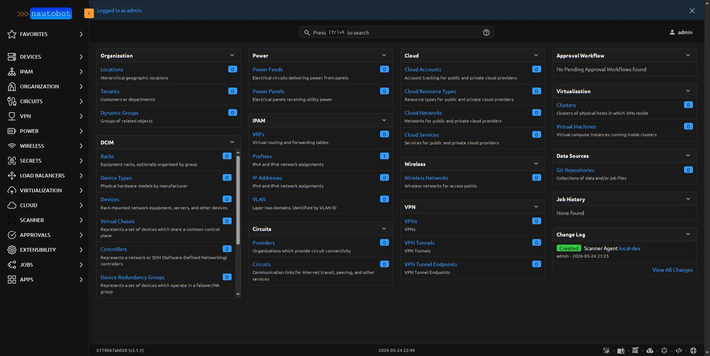
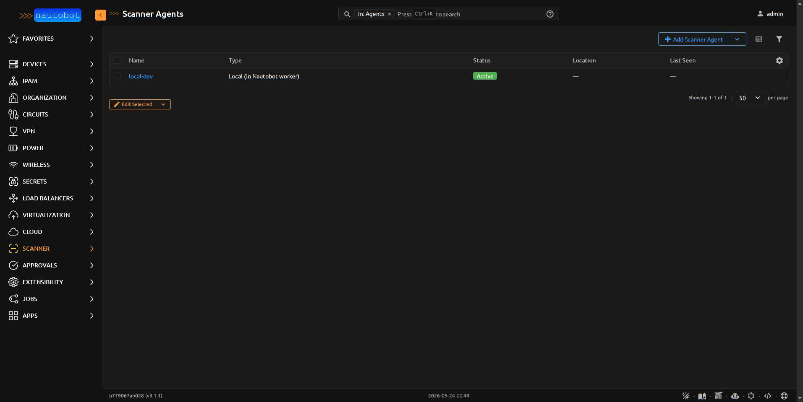

# Getting Started

A first-scan walkthrough. Assumes you've already installed the app
(see [Install](../admin/install.md)) and the dev stack or a Nautobot
instance is reachable.

<figure markdown>

<figcaption>The Scanner nav entry appears in Nautobot's left rail once the app is installed.</figcaption>
</figure>

## 1. Create a local scanner agent

Most installs start with a single local agent — nmap runs inside the
Nautobot worker. (For scans of isolated segments, see
[Scanner Agents](agents.md) for the remote-agent flow.)

**Apps > Scanner > Scanner Agents > Add**:

| Field | Value |
|-------|-------|
| Name | `default-local` |
| Agent type | `Local (in Nautobot worker)` |
| Status | `Active` |
| Location | (optional) |

Local agents don't need a bound `User` — that's only for remote agents
authenticating to the REST API.

<figure markdown>

<figcaption>The new agent appears in the **Scanner Agents** list.</figcaption>
</figure>

## 2. Create a scan profile

Profiles are reusable nmap argument templates. A safe first profile:

**Apps > Scanner > Scan Profiles > Add**:

| Field | Value |
|-------|-------|
| Name | `discovery-fast` |
| Scan type | `Host discovery` |
| nmap arguments | `-sn` |
| Timing template | `T3 — Normal (default)` |
| Enabled scripts | _(empty)_ |

`-sn` means "ping scan, no port scan" — fast, low-impact, ideal for
finding what's alive in a /24.

For a real port scan, try:

| Field | Value |
|-------|-------|
| Name | `tcp-top-1000-version` |
| Scan type | `Service / version detection` |
| nmap arguments | `-sS -sV --top-ports 1000` |
| Timing template | `T4 — Aggressive` |

See [Scan Profiles](scan_profiles.md) for a reference of common combos.

<figure markdown>

<figcaption>Profiles list view — each profile is reusable across any agent.</figcaption>
</figure>

## 3. Pick a target prefix

In Nautobot's IPAM, navigate to a `Prefix` you control and want to
scan. (You can also pick individual IPAddresses if you only want to
target a few hosts.)

!!! danger "Scope and authorization"
    Only scan hosts and networks you own or have written authorization
    to scan. Aggressive nmap timing (T4/T5) against networks you don't
    control may violate computer-fraud statutes in your jurisdiction.

## 4. Dispatch the scan

**Apps > Jobs > Scanner: Run Scan**:

| Field | Value |
|-------|-------|
| Scanner agent | `default-local` |
| Scan profile | `discovery-fast` |
| Target prefixes | (your prefix from step 3) |
| Target ipaddresses | _(empty for prefix scan)_ |
| Allow overlap | unchecked |

Click **Run Job Now**. The scan starts immediately (since this is a
local agent — remote agents pick up at their next poll interval).

## 5. View the results

**Apps > Scanner > Scans > (your scan row)** shows:

- Lifecycle state (`pending → running → completed`)
- Started/completed timestamps
- Linked `JobResult` (full execution log)
- Summary counts
- Linked `DiscoveredHost` rows (click into any host for ports / fingerprints / vulns)

<figure markdown>

<figcaption>The Scan detail page bundles everything you need to triage a completed run.</figcaption>
</figure>

If you scanned a prefix that contains an IPAddress already in IPAM, the
matching `DiscoveredHost` should have `linked_ipaddress` populated —
visit that IPAddress in IPAM and you'll see a **Scanner** panel on the
right side with recent scan summaries.

## 6. (Optional) Promote a discovered host to IPAM

If your scan found a host you'd like in IPAM, open the `DiscoveredHost`
detail page and click **Promote to IPAddress**. See
[Promote to IPAddress](promotion.md) for the form fields and
permission requirements.
