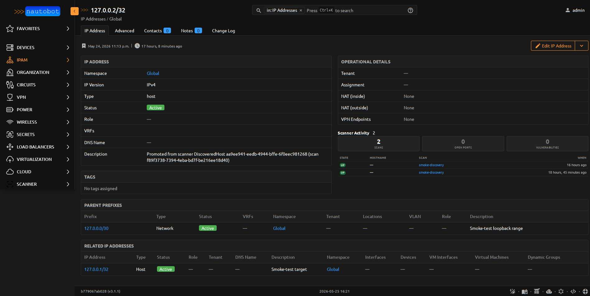
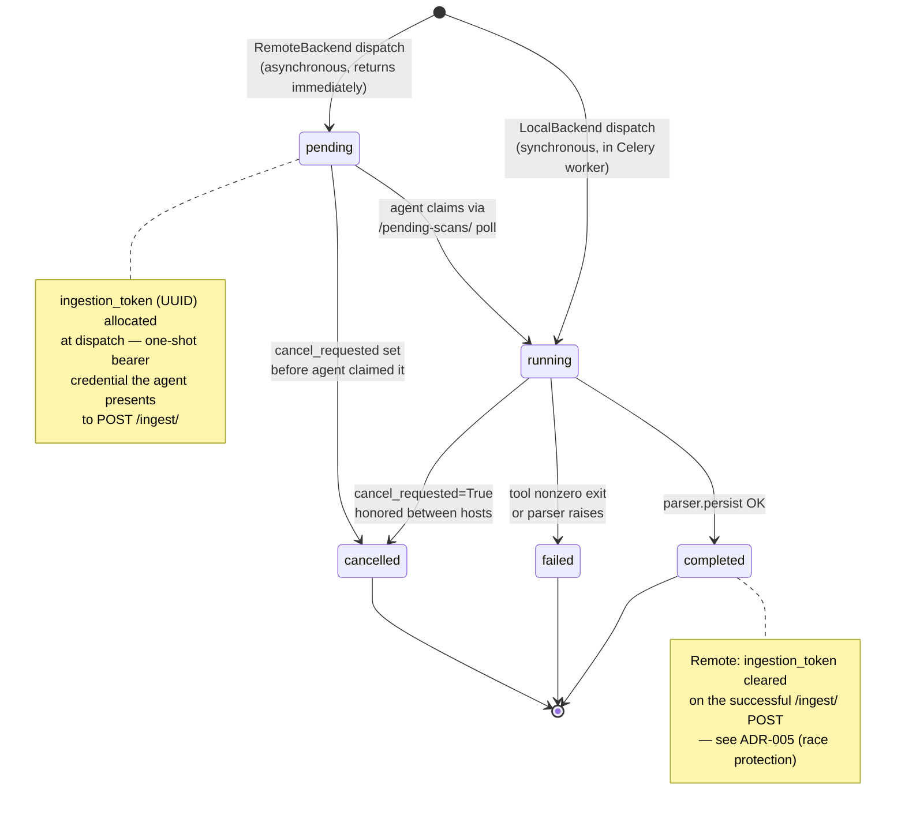

# App Overview

<figure markdown>

<figcaption>A completed scan's detail page — stat cards summarize results, the right panel lists each `DiscoveredHost`.</figcaption>
</figure>

## What gets stored

The app turns probe-tool output (nmap XML, dig/drill text, mtr/masscan
JSON, curl HTTP response, openssl handshake dump) into Nautobot ORM
records. Each `Scan` produces zero-or-more `DiscoveredHost` rows; each
host can have ports, findings, and traceroute hops attached.

```
ScannerAgent ──┐
               ├──→ Scan ──→ DiscoveredHost ──┬──→ DiscoveredPort ──→ NseFinding
ScanProfile ───┘             (linked_ipaddress, └──→ TraceRouteHop
                              linked_device)
```

| Layer | Models | Purpose |
|-------|--------|---------|
| **Identity** | `ScannerAgent`, `ScanProfile` | Who runs scans, with what tool + arguments |
| **Execution** | `Scan` | One scan run — agent + profile + IPAM targets + lifecycle state + raw output (XML for nmap, gzipped text/JSON for everything else) |
| **Results** | `DiscoveredHost`, `DiscoveredPort`, `NseFinding`, `TraceRouteHop` | What the probe actually found |

See the [Data Models reference](../models/index.md) for field-by-field
details.

## Where it integrates with the rest of Nautobot

| Nautobot model | Relationship | What it enables |
|----------------|-------------|-----------------|
| `ipam.Prefix` | `Scan.target_prefixes` (M2M) | Scan a whole prefix in one job |
| `ipam.IPAddress` | `Scan.target_ipaddresses` (M2M), `DiscoveredHost.linked_ipaddress` (FK) | Scan specific IPs; link discovered hosts back to known IPAM records |
| `dcim.Device` | `DiscoveredHost.linked_device` (FK) | Auto-resolved at ingest by matching scan IPs against `Device.primary_ip4/6` |
| `dcim.Location` | `ScannerAgent.location` (FK) | Annotate where each agent is deployed |
| `extras.JobResult` | `Scan.job_result` (FK) | Trace any Scan back to the Nautobot Job run that started it |
| `auth.User` (Nautobot's swapped `users.User`) | `ScannerAgent.user` (OneToOne) | DRF Token on this user authenticates remote agents |

<figure markdown>

<figcaption>The **Scan Coverage** panel injects directly into the IPAM `Prefix` detail page via a `TemplateExtension` — coverage percentage, IPs scanned, hosts up, and recent scan history all in one glance. Same pattern works for `dcim.Device` and `ipam.IPAddress` detail pages.</figcaption>
</figure>

<figure markdown>

<figcaption>The same pattern on an `ipam.IPAddress` detail page — the **Scanner Activity** panel lists every scan that observed this address, with link-through to the per-scan `DiscoveredHost` rows.</figcaption>
</figure>

<figure markdown>

<figcaption>And on a `dcim.Device` detail page — agent-side resolution via `DiscoveredHost.linked_device = Device.primary_ip4.match` means scans automatically attach to the right device record at ingest time, no manual linkage step.</figcaption>
</figure>

## Scan lifecycle



All five lifecycle states (`pending`, `running`, `completed`, `failed`,
`cancelled`) are first-class enum values on
[`ScanStateChoices`](../models/scan.md). The state machine is the
*authoritative* shape — every transition is gated by `select_for_update`
+ status check in [ADR-005](../dev/architecture.md#adr-005-ingest-race-protection-one-shot-token-select_for_update),
so two concurrent agents trying to claim the same `pending` scan still
result in exactly one winner.

## Read-only enrichment, with a promotion escape hatch

The app stores scan output in **separate models** from IPAM/DCIM. It
never silently creates an `ipam.IPAddress` from scan data — a transient
NAT, a misconfigured DHCP server, or a one-shot test container could
otherwise pollute your source-of-truth.

When a `DiscoveredHost` should become a real IPAddress, an authorized
user (with `ipam.add_ipaddress` permission) clicks **Promote to
IPAddress** on the host page. The form is pre-filled from the host's IP
and hostname; the user picks namespace/parent_prefix/status/tenant. See
[Promote to IPAddress](promotion.md) for the full flow.

## What's NOT in the app

To keep scope tight, the following were considered and explicitly
omitted:

- **Auto-sync IPAM from scans** — too risky (false positives become
  real IPAM records). Use the Promote action instead.
- **`ARPBinding` model** — `DiscoveredHost.mac_address` already
  captures ARP-resolved MACs; a separate model invited duplicate-truth
  bugs.
- **Custom cron scheduler** — Nautobot's built-in Job scheduler does
  this; we add a Job (`RunScan`) and let operators schedule it.
- **`ServiceFingerprint` model** — fingerprint fields (`product`,
  `version`, `extra_info`, `cpe`) live directly on `DiscoveredPort` —
  nmap's `-sV` pass produces them with the `service_name` anyway,
  so splitting them costs an extra join with zero benefit.
