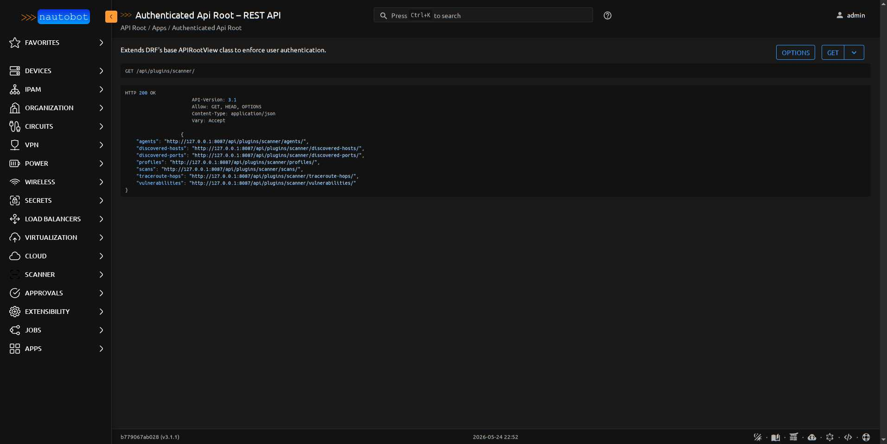
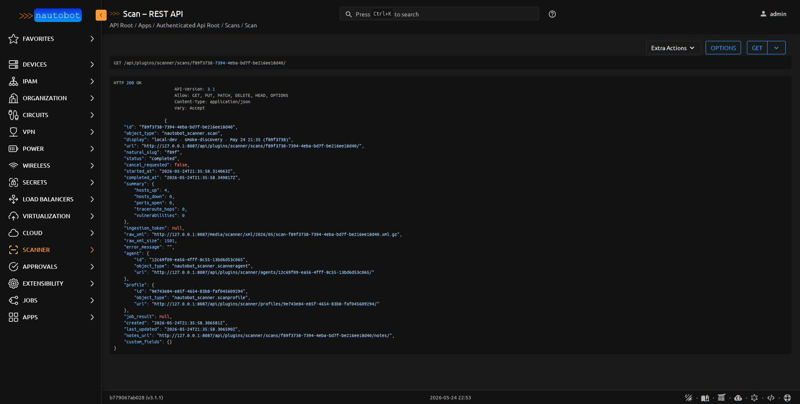

# External Interactions

What the app talks to outside Nautobot, and what talks to the app.

## What the app calls out to

| Target | Protocol | Purpose | When |
|--------|----------|---------|------|
| Probe tool binary (`nmap` / `dig` / `drill` / `curl` / `mtr` / `masscan` / `openssl`) | subprocess | Run the actual scan — which binary depends on `ScanProfile.tool` | LocalBackend, every Scan |
| (none for RemoteBackend) | — | RemoteBackend doesn't call out — it just flips Scan state | — |

The `LocalBackend` requires whichever tool(s) you've configured on
seeded profiles to be installed on the Nautobot worker host. The dev
Docker image bakes `nmap` in; for the full Phase-G + J tool set,
either base the worker image on `nicolaka/netshoot` (same approach the
[reference remote agent](../admin/install_remote_agent.md#base-image-nicolakanetshoot-phase-g)
uses) or install the additional tools alongside nmap. A profile that
asks for a tool the worker doesn't have fails the scan cleanly with
the missing-tool name in `Scan.error_message`.

## What calls into the app

| Caller | Endpoint | Auth | Purpose |
|--------|----------|------|---------|
| Remote agent | `GET /api/plugins/scanner/agents/<id>/pending-scans/` | DRF Token | Poll for assigned scans in `pending` status |
| Remote agent | `POST /api/plugins/scanner/scans/<id>/ingest/` | DRF Token + `X-Ingestion-Token` header | Post raw probe-tool output (nmap XML, dig/drill text, mtr/masscan JSON, curl response, openssl handshake) for parsing. The `X-Tool` header selects which parser runs. |
| Remote agent | `POST /api/plugins/scanner/agents/<id>/checkin/` | DRF Token | Heartbeat + capability report |
| Anyone with permissions | Standard CRUD via `/api/plugins/scanner/*` | Session / DRF Token | Read/write any model |

See [Agent Protocol](../dev/agent_protocol.md) for the full REST
contract.

<figure markdown>

<figcaption>DRF browsable API at `/api/plugins/scanner/` — the seven CRUD viewsets plus the agent-specific endpoints.</figcaption>
</figure>

<figure markdown>

<figcaption>A scan's serialized JSON. Note `ingestion_token: null` — the one-shot token is cleared after a successful ingest (see [ADR-005](../dev/architecture.md#adr-005-ingest-race-protection-one-shot-token-select_for_update)).</figcaption>
</figure>

## Outbound network from the agent host

A remote agent host needs:

- L3 reachability to its scan targets (inbound TCP/UDP for SYN/UDP
  scans, ICMP for host discovery, etc. — depends on what nmap flags
  you use)
- L3 reachability to the Nautobot API (HTTPS, typically port 443)
- DNS resolution for the Nautobot API hostname

The Nautobot host doesn't need any reachability to the agent — the
flow is agent-pulled, not server-pushed.

## Firewall / IDS considerations

nmap scans are detectable by any half-decent IDS. Talk to your security
team before pointing this at anything outside your own networks. The
`TimingTemplateChoices` includes T0 (Paranoid) and T1 (Sneaky)
templates specifically for IDS-evasion contexts, but those are slow.
