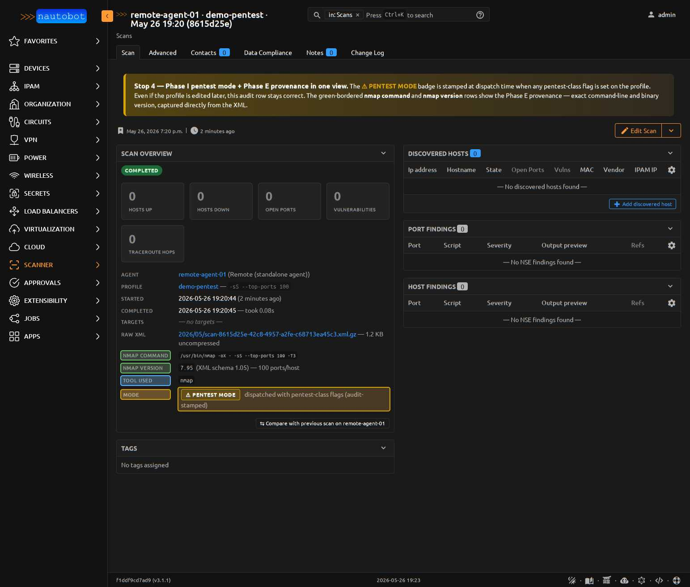

# Pentest Mode

Pentest mode gates dispatch of any `ScanProfile` that's recon-aggressive
enough to need explicit legal authorization. Two paths trigger it:

1. **The five nmap evasion flags** — decoys, fragmentation, custom MTU,
   source-port spoofing, and idle scan (Phase I).
2. **The tool itself is recon-aggressive** — masscan at 10k+ pps is
   unmistakable to any IDS regardless of flags, so `tool in
   PENTEST_TOOLS` (currently `{"masscan"}`) auto-trips the gate too
   (Phase J).

**Dispatching any pentest-mode profile requires explicit authorization
from your organization and the `nautobot_scanner.use_pentest_profiles`
Django permission.** This page covers the legal context, permission
setup, and operational gotchas.

!!! warning "Legal authorization first"
    The pentest-mode flags are evasion techniques designed to make a
    scan harder to detect or attribute. Using them against systems
    you don't have **written authorization to test** is illegal in
    most jurisdictions — the legal frameworks (CFAA in the US,
    Computer Misuse Act in the UK, equivalent laws elsewhere) make
    no distinction between "I was just looking" and a real intrusion
    attempt. Get your authorization in writing, scoped to specific
    target ranges, before you flip the permission on for any user.

<figure markdown>

<figcaption>A completed pentest scan. The ⚠ **PENTEST MODE** badge is stamped at dispatch time — even if the profile is edited later, this audit row stays correct. The green-bordered nmap_command and nmap_version rows show the [Phase E provenance](../models/scan.md#scan-provenance-captured-from-nmap-xml-at-ingest) — exact command-line and binary version captured directly from the XML.</figcaption>
</figure>

## What turns a profile into "pentest mode"

A profile is pentest-mode if **either**:

**(a) any of these five nmap evasion flags is set** —
[ScanProfile fields](../models/scanprofile.md#pentest-mode-fields-phase-i):

| Field | nmap flag | What it does |
|---|---|---|
| `decoy_addresses` | `-D <list>` | Spoofs additional source addresses alongside the agent's real one |
| `fragment_packets` | `-f` | Fragments outgoing packets to confuse simple IDS rules |
| `mtu` | `--mtu N` | Fragments with custom MTU (overrides `-f`) |
| `source_port` | `--source-port N` | Spoofs source port (53/88/443 often bypass naive ACLs) |
| `idle_scan_zombie` | `-sI <zombie_ip>` | Routes all probes through a zombie host; target sees zombie as the attacker |

…**or (b) `tool` is in the `PENTEST_TOOLS` allowlist**:

| Tool | Why it's gated |
|---|---|
| `masscan` | The seeded `masscan-sweep` profile dispatches at 50k pps with `-p 0-65535` — that traffic shape is unmistakable to any IDS, regardless of evasion flags. Tool-identity gating triggers `is_pentest_mode=True` even on a vanilla masscan profile with no nmap-style flags set. |

The `is_pentest_mode` computed property is the single source of
truth — server-side dispatch checks it, the UI form badges the
profile yellow when it's true, and the agent's argv builder reads
the `profile['pentest']` dict from the pending-scans payload.

## Permission setup

Grant `nautobot_scanner.use_pentest_profiles` to a user (or group)
through Nautobot's standard permission system:

1. **Admin → Permissions → Add**
2. **Name**: something operationally descriptive, e.g. `Scanner: dispatch pentest profiles`
3. **Actions**: leave blank (this permission isn't tied to CRUD on a model)
4. **Object types**: `nautobot_scanner | scan profile`
5. **Constraints**: optional — you can scope to specific profiles
   or target locations via Nautobot's standard JSON-filter syntax
6. **Users / Groups**: assign to whoever has the legal authorization

`view_scanprofile` and `change_scanprofile` are unrelated — operators
without `use_pentest_profiles` can still **see** and **edit** a
pentest profile; they just can't **dispatch** one.

## What happens at dispatch time

The `RunScan` job, `ScanPrefix` job, and the **Rescan this host**
button all funnel through `utils.check_pentest_permission()` before
creating the `Scan` record:

```python
# nautobot_scanner/utils.py
def check_pentest_permission(user, profile) -> bool:
    is_pentest = bool(getattr(profile, "is_pentest_mode", False))
    if is_pentest and not user.has_perm(PENTEST_PERMISSION):
        raise PermissionDenied(
            f"Profile {profile.name!r} uses pentest-class flags "
            f"(decoys/fragmentation/idle scan/custom MTU/source-port). "
            f"Dispatching requires the "
            f"`nautobot_scanner.use_pentest_profiles` permission AND "
            f"appropriate legal authorization for the targets."
        )
    return is_pentest
```

Two outcomes:

| User has perm? | Profile is pentest-mode? | Result |
|---|---|---|
| No | No | Normal dispatch (no check fires) |
| No | Yes | `PermissionDenied` with the legal notice |
| Yes | No | Normal dispatch, `was_pentest_mode=False` stamped |
| Yes | Yes | Dispatch proceeds, `was_pentest_mode=True` stamped on the Scan row |

The returned `is_pentest` flag flows directly into
`Scan.was_pentest_mode` — see
[ADR-014](../dev/architecture.md#adr-014-pentest-mode-permission-gating-immutable-audit-flag)
for why the flag is stamped per-scan rather than derived at render
time.

## Auditing pentest activity

Because `Scan.was_pentest_mode` is a db-indexed Boolean stamped at
dispatch:

- **Scanner → Scans** list view filter `?was_pentest_mode=True`
  surfaces every pentest run
- The list view's **Mode** column shows the badge inline
- The Scan detail page renders the ⚠ **PENTEST MODE** banner
  (shown in the screenshot above)
- Webhooks, exports, change-log entries, and GraphQL queries all
  carry the field without custom serializer code

The flag is **never recomputed** — even if the underlying profile
is edited or deleted after the scan ran, the audit answer "was
THIS scan a pentest run?" stays correct forever.

## Operational gotchas

- **`--mtu` overrides `-f`.** If you set both `fragment_packets=True`
  and `mtu=24`, the resulting nmap command line includes `--mtu 24`
  and nmap silently ignores `-f`. The form's `clean_mtu()`
  validator enforces nmap's multiple-of-8 constraint before the
  field reaches the agent.
- **Decoy ordering matters.** Use `ME` to position the agent's real
  address inside the decoy list (e.g. `192.0.2.1,192.0.2.2,ME,192.0.2.3`).
  Without `ME`, nmap appends the real address to the end —
  defeating the obfuscation since the last sender is often the most
  forensically interesting one.
- **Idle scan needs a willing zombie.** `idle_scan_zombie` requires
  a host with predictable IP-ID sequencing. Most modern OSes
  randomize IP-ID, breaking the technique. Test against a known-
  vulnerable zombie before scoping a real engagement around it.
- **`source_port=53` bypasses naive ACLs**, but stateful firewalls
  will still drop the response. Test your bypass theory on a
  non-production target before relying on it.
- **Pre-Phase-I agents silently skip the dict.** The dispatch path
  already prevents pentest fields from reaching old agents, but
  worth knowing if you're mixing agent versions during a rolling
  upgrade.

## See also

- [ScanProfile model — pentest fields](../models/scanprofile.md#pentest-mode-fields-phase-i)
- [Scan model — `was_pentest_mode`](../models/scan.md)
- [ADR-014](../dev/architecture.md#adr-014-pentest-mode-permission-gating-immutable-audit-flag) — design rationale
- [Scan Profiles → Pentest profiles](scan_profiles.md) — the seeded `demo-pentest` profile
