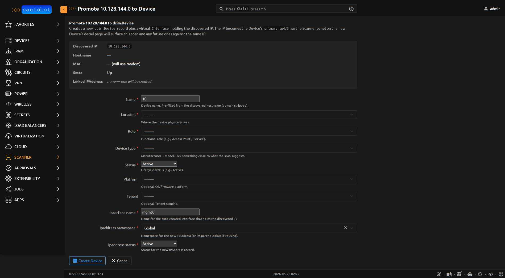

# Promote a Discovered Host

Scanner is read-only enrichment by default — discovered hosts live in
their own `DiscoveredHost` model and never silently become
`ipam.IPAddress` or `dcim.Device` records. Two **Promote** actions on
the host detail page are the explicit escape hatches.

| Action | Creates | Use when |
|---|---|---|
| [Promote to IPAddress](#promote-to-ipaddress) | `ipam.IPAddress` | You want to track an address but the host isn't really a managed device — DHCP leases, NAT'd hosts, ephemeral containers. |
| [Promote to Device](#promote-to-device) | `dcim.Device` + `Interface` + `IPAddress` | The host is real network equipment / server you'll manage long-term. |

Both actions are atomic and idempotent: re-running against an already-
promoted host reuses the existing record rather than duplicating.

## Promote to IPAddress

## Why this is opt-in

Auto-creating IPAM records from scan output is dangerous:

- A transient NAT or container that responded once becomes a permanent
  IPAM row that ages out as "missing"
- A misconfigured DHCP server bursting through the address space
  creates dozens of bogus IPAddresses
- A spoofing attacker decides what shows up in your source of truth

The Promote action puts a human in the loop and forces an explicit
permission check.

## Permission requirements

The promote view checks `request.user.has_perm("ipam.add_ipaddress")` —
**not** just scanner permissions. You can be a Scanner admin and still
get denied if you can't add IPAddresses in IPAM. This is intentional:
creating an IPAddress is an IPAM-side operation.

If you need to give an operator promote capability:

1. Grant the user (or their group) the **add_ipaddress** permission
   under **Admin > Permissions**
2. Restrict by object filter if needed (e.g., only allow promoting
   hosts in specific prefixes)

## The flow

1. Open the `DiscoveredHost` detail page (Apps > Scanner > Discovered
   Hosts > _row_)
2. Click **Promote to IPAddress** in the actions menu
3. The form pre-fills:
   - **Address**: from `DiscoveredHost.ip_address`
   - **DNS Name**: from `DiscoveredHost.hostname` (if present)
4. You fill in:
   - **Namespace** (typically "Global")
   - **Parent Prefix** (auto-suggested from the scan's target prefixes)
   - **Status** (typically "Active")
   - **Tenant** (optional)
   - **Tags** (optional)
5. Submit. The view:
   - Creates the `ipam.IPAddress`
   - Sets `DiscoveredHost.linked_ipaddress` to the new record
   - Redirects you to the new IPAddress detail page

## What happens to the DiscoveredHost

Promotion doesn't delete the `DiscoveredHost`. It links to the new
IPAddress so future scans of the same IP will:

- Match the existing IPAddress via the `linked_ipaddress` FK
- Show up in the **Scanner** panel on that IPAddress's detail page
- Get scan-summary data on the IPAddress's history

## Promote to Device

When a discovered host is real network gear (a server, a router, a
switch you can SSH into), promote straight to `dcim.Device` instead of
just IPAddress. This one action creates the full DCIM record: Device,
a virtual Interface holding the IP, and the IPAddress itself (or
reuses an existing one).

### Permission requirements

The view checks **all three**:

- `nautobot_scanner.change_discoveredhost`
- `dcim.add_device`
- `dcim.add_interface`
- `ipam.add_ipaddress`

Grant the operator (or their group) the DCIM + IPAM permissions in
**Admin > Permissions** as for any Device-creation flow.

### The atomic transaction

All six steps run in one `transaction.atomic()` — partial failures roll
back. No half-promoted Devices.

1. Create the `Device` from the form (name, location, role, device_type,
   status, optional platform / tenant)
2. Resolve the `IPAddress`, picking the first match from:
   - `DiscoveredHost.linked_ipaddress` already set (Promote-to-IPAddress
     happened first)
   - An `IPAddress` with the same host + namespace already exists (avoids
     unique-constraint collisions when a seed script created it)
   - Else: create a fresh `IPAddress`
3. Create a virtual `Interface` on the new Device, with the discovered
   MAC if nmap captured one (requires the agent to have ARP/raw-socket
   access — see [Install Remote Agent](../admin/install_remote_agent.md))
4. Assign the IPAddress to the Interface
5. Set `Device.primary_ip4` (or `primary_ip6`) to the IPAddress — this
   is what makes future scans auto-resolve `DiscoveredHost.linked_device`
6. Set `DiscoveredHost.linked_device = device`

### The flow

1. Open the `DiscoveredHost` detail page
2. Click **Promote to Device** in the actions menu
3. The form pre-fills:
   - **Name**: from `hostname` (or the IP if hostname is blank)
   - **Status**: `Active`
   - **Interface name**: `mgmt0`
   - **IPAddress namespace**: `Global`
   - **IPAddress status**: `Active`
4. You fill in the heavier required fields (Location, Role, Device Type)
   plus optional Platform / Tenant
5. Submit. You're redirected to the new Device's detail page, where the
   **Scanner** panel will surface this scan's results

<figure markdown>

<figcaption>The Promote-to-Device form. The metadata box up top shows what was discovered; the form below collects the DCIM context (Location, Role, DeviceType) that scan data alone can't provide.</figcaption>
</figure>

### Common gotchas

- **"Device with this name already exists"** — Device names must be unique
  per Location (or globally, depending on your Nautobot's
  `DEVICE_UNIQUENESS` setting). Pick something distinct.
- **No DeviceType in the dropdown** — you haven't created any. Nautobot
  requires at least one `DeviceType` (manufacturer + model) to exist
  before any Device can be promoted. Seed the minimum via
  `development/scripts/seed_dcim_minimum.py` for dev environments.
- **"DeviceType has no positions"** — the `DeviceType` you picked is
  rack-mounted and requires a Rack position. For ad-hoc Device creation
  from scan output, use a `DeviceType` with no rack constraint
  (`subdevice_role=None`, `u_height=0`).

## What both promotions do NOT do

- They don't carry forward open ports, OS guesses, or vulnerabilities to
  the new IPAddress or Device — those stay attached to the scan row,
  where they belong as historical artifacts. The Scanner panel on the
  IPAddress / Device detail page reads them back via the link.
- They don't write any of the discovered host's metadata into IPAddress
  or Device custom fields by default. If you want that, write a signal
  handler (see [Extending](../dev/extending.md)).
- Promote-to-Device doesn't run any subsequent action on the new Device
  (no automatic config-compliance check, no DNS PTR validation, no
  Onboarding job dispatch). It just gets the Device into IPAM/DCIM; the
  rest is your existing Nautobot workflow.
