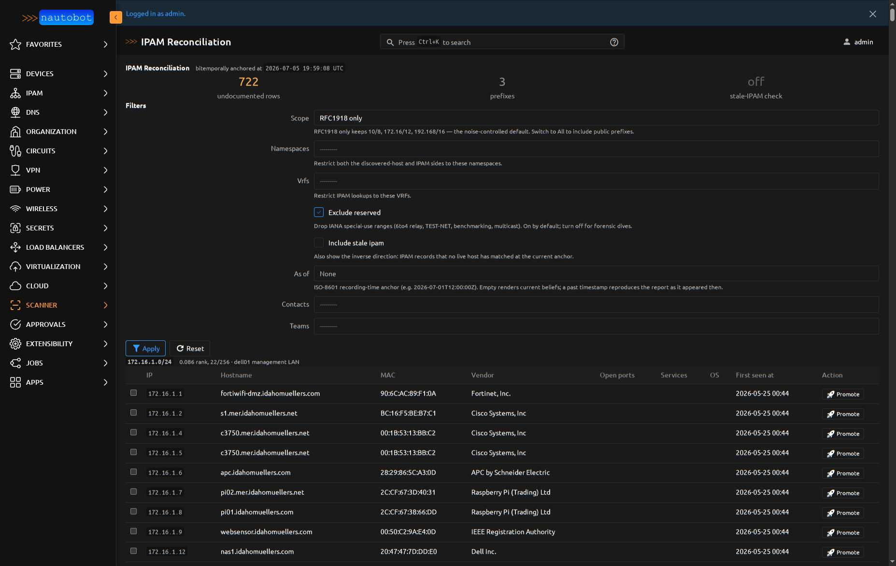
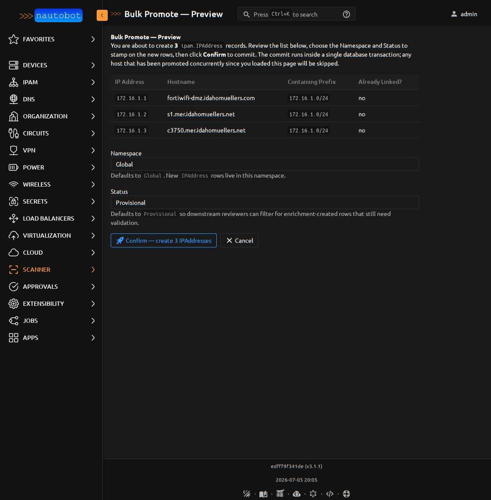
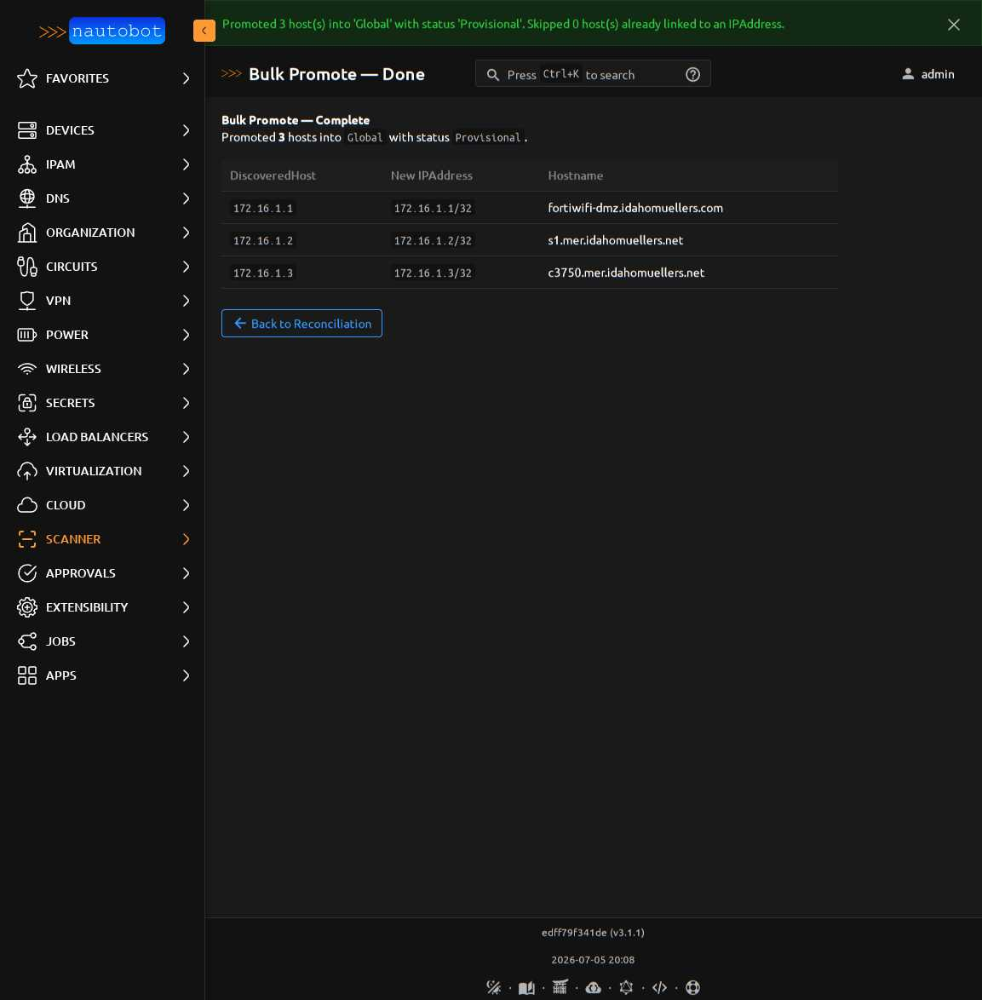
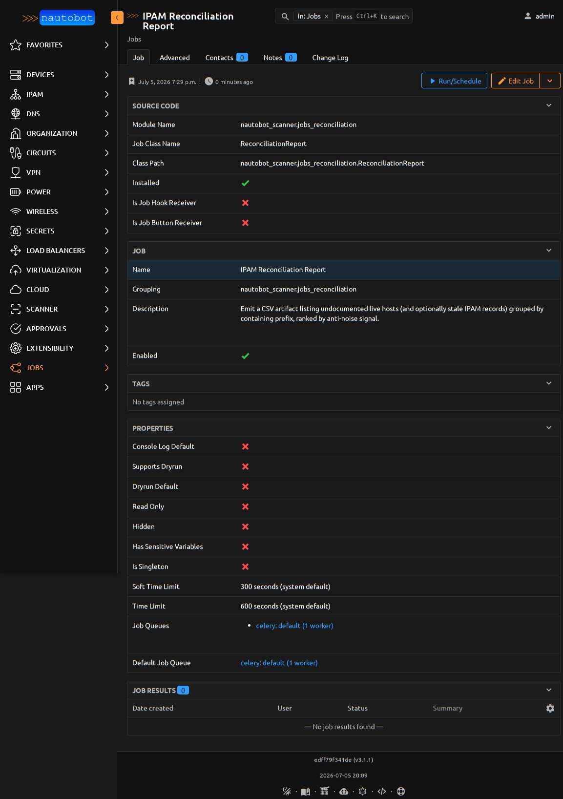

# IPAM Reconciliation

The reconciliation report answers one question: **which live discovered
hosts don't yet have an `ipam.IPAddress` record?** It's the natural
next step after running scans — instead of clicking through hundreds
of hosts one at a time on the [Promote](promotion.md) page, you get a
prefix-grouped diff of everything the scanner has seen but IPAM
doesn't know about, plus a bulk-promote flow to close the gap.

Skip to:

- [When to use it](#when-to-use-it) — vs one-at-a-time promote
- [The report](#the-report) — layout, anti-noise ranking, filters
- [Bulk promote](#bulk-promote) — preview + confirm flow
- [The `Provisional` status](#the-provisional-status)
- [CSV export via Job](#csv-export-via-job)
- [Per-scan reconciliation tab](#per-scan-reconciliation-tab)
- [Management command](#management-command)
- [As-of anchoring (bitemporal)](#as-of-anchoring)

## When to use it

| Situation | Use |
|---|---|
| Post-scan cleanup — a discovery scan finished and you want to see what's new | Reconciliation report |
| A single host with unusual context — you want to inspect its ports/services before deciding | [Promote to IPAddress](promotion.md#promote-to-ipaddress) |
| Broad "backfill IPAM from a green-field network" | Reconciliation → filter to the target prefix → Bulk promote |
| "What was undocumented on 2026-05-01?" for an audit or retrospective | Reconciliation with an [as-of anchor](#as-of-anchoring) |

Nav: **Apps → Scanner → Results → IPAM Reconciliation**.

## The report



Header stats surface three counts at a glance:

- **undocumented rows** — live `DiscoveredHost` records that don't have a matching `ipam.IPAddress` at the current [bitemporal anchor](#as-of-anchoring)
- **prefixes** — how many containing prefixes these hosts land in
- **stale-IPAM check** — whether the inverse direction (IPAM records with no matching live host) is included

Below the stats, rows are grouped by containing prefix and each group
shows an **anti-noise rank**.

### Anti-noise ranking

Each prefix header carries a number like `0.086 rank, 22/256`. That's
the ratio of `discovered_count / prefix_size` — a **lower rank
sorts higher** because sparse-but-real subnets are the ones you
actually want to work on.

Example from the screenshot above:

| Prefix | Rank | Discovered | Prefix size | What it means |
|---|---|---|---|---|
| `172.16.1.0/24` | **0.086** | 22 | 256 | Real management LAN, sparse — legitimate work |
| `10.128.144.0/24` | **1.047** | 268 | 256 | Docker internal network — phantom-full, low value |

The `10.128.144.0/24` block shows more discovered hosts than the
prefix contains, which is the signature of ephemeral container IPs
that were seen once and won't come back. The ranking pushes them to
the bottom so the operator's eye lands on the real work first.

Prefixes with rank `> 1.0` are almost always phantom-noise — Docker
overlays, `169.254.0.0/16` link-local, `192.88.99.0/24` 6to4 relay
artifacts. If a prefix you care about is landing there, look at the
scan targets first before assuming the ranking is wrong.

### Filters

The sidebar exposes six knobs, all optional:

| Filter | Default | What it does |
|---|---|---|
| Scope | `RFC1918 only` | Keeps 10/8, 172.16/12, 192.168/16 — the noise-controlled default. Switch to *All ranges* only when you genuinely need public prefixes (external asset discovery). |
| Namespaces | (all) | Restrict both sides of the diff to these namespaces. |
| VRFs | (all) | Restrict IPAM lookups to these VRFs. |
| Exclude reserved | ✓ on | Drops IANA special-use ranges (6to4 relay, TEST-NET, benchmarking, multicast). Turn off for forensic dives. |
| Include stale IPAM | ✗ off | Adds the inverse direction: IPAM records that no live host matched at the anchor. Doubles query cost. |
| As of | (empty) | ISO-8601 recording-time anchor for reproducing the report as it appeared at a past point. Empty = current beliefs. |

## Bulk promote

Tick the checkboxes on the left of each row in the report, then click
**Bulk Promote Selected** at the top. That POSTs to the preview page:



The preview shows exactly what will be created:

- **IP address, hostname, containing prefix** for each selected host
- **Already Linked?** column — `yes` means the `DiscoveredHost` already points to an existing IPAddress and will be skipped
- **Namespace** dropdown — defaults to `Global`
- **Status** dropdown — defaults to `Provisional` (see below)

Click **Confirm** to commit. The whole batch runs inside one
`transaction.atomic()`, so a mid-batch failure rolls back everything
— you retry a clean batch instead of untangling half-created rows.

The commit is **idempotent and self-healing**: if an `IPAddress`
already exists at `(namespace, host_ip)` — because an operator added
it manually or an earlier batch left an orphan — the DiscoveredHost
gets linked to the existing row rather than triggering a duplicate-
key error. Re-running against the same selection converges to the
same state.



The success page links to each new (or newly-linked) `ipam.IPAddress`
so you can jump straight to the IPAM detail page.

### Permission

Bulk promote checks `ipam.add_ipaddress` — same permission as the
single-host [Promote](promotion.md#permission-requirements). Scanner
admin alone isn't sufficient.

## The `Provisional` status

New `IPAddress` rows created by bulk promote default to a **`Provisional`**
status (amber `#ffc107`). This is intentional: scanner-created rows
are enrichment candidates, not verified IPAM records. Downstream
reviewers can filter for `status=Provisional` to find them.

The status is created by migration `0023_seed_provisional_status.py`
and attached to both `ipam.IPAddress` and `ipam.Prefix` content types.
The migration is idempotent (uses `get_or_create`) — if you already
have a `Provisional` status defined elsewhere, it's picked up rather
than duplicated.

To promote a row out of `Provisional` after verification:

1. Open the IPAddress detail page
2. Edit → change **Status** to `Active`
3. Save

## CSV export via Job

For long-form review or handoff to another team, run the
**IPAM Reconciliation Report** Job:



Nav: **Jobs → IPAM Reconciliation Report**. The Job accepts the same
filter shape as the interactive view (scope, namespaces, VRFs,
exclude-reserved, include-stale-IPAM, as-of), executes the same
engine, and emits the result as a CSV artifact attached to the
`JobResult`. Columns:

| Column | Notes |
|---|---|
| `prefix` | The containing prefix (`172.16.1.0/24` etc.) |
| `rank` | `discovered_count / prefix_size` — see [anti-noise ranking](#anti-noise-ranking) |
| `ip` | Discovered host's IP address |
| `hostname` | From `DiscoveredHost.hostname` |
| `mac`, `vendor` | If present |
| `open_ports`, `services`, `os` | For DiscoveredHost's most recent scan |
| `first_seen_at` | Bitemporal — when this observation first landed |
| `namespace` | Target namespace for reconciliation |

You can schedule the Job on a cron cadence via Nautobot's built-in
scheduler — daily reconciliation CSV, delivered to the JobResult
detail page, ready to hand off.

## Per-scan reconciliation tab

The same engine is available scoped to a single scan. On any Scan
detail page, click **Reconciliation** — you'll see only the hosts
this scan discovered, grouped by prefix, ranked the same way. Useful
for post-scan review immediately after a targeted discovery run,
without wading through prior scans' data.

Nav: **Scans → _row_ → Reconciliation tab**.

## Management command

For headless / CI use, the same engine is available as a Django
management command:

```bash
nautobot-server bulk_promote_discovered_hosts \
  --namespace Global \
  --status Provisional \
  --dry-run
```

Flags:

- `--dry-run` (default) — print what would be created; touch nothing
- `--confirm` — commit the promotes (both flags are safe; `--confirm` overrides)
- `--namespace <name>` — target namespace, defaults to `Global`
- `--status <name>` — status for newly-created rows, defaults to `Provisional`

The command reads the same reconciliation engine as the UI, so a
`--dry-run` in a nightly cron catches drift between scanner and IPAM
without touching the database.

## As-of anchoring

Reconciliation is **bitemporally anchored** — every query resolves
`DiscoveredHost` observations using the recording-time convention
described in the bitemporal docs.

- **Empty `as-of`** → current beliefs (the most recent observation of each host)
- **Timestamp `as-of`** → the report as it appeared at that recording-time

The past-anchor view is useful for:

- Audit: "what was undocumented as of 2026-05-01?"
- Retrospective: "did we have this fortiwifi in IPAM last week or is it new?"
- Blame-free forensics: reconstruct the operator's view without needing to run
  scans against the current state of the network

## Related

- [Promote a Discovered Host](promotion.md) — one-at-a-time flow that
  the reconciliation view is a bulk wrapper around
- [Use Cases](use_cases.md) — where reconciliation fits into the
  broader scanner workflow
- [Comparing Scans](scan_diff.md) — the other bitemporal surface;
  same as-of anchoring shape, focused on scan-to-scan diffs rather
  than the IPAM diff
