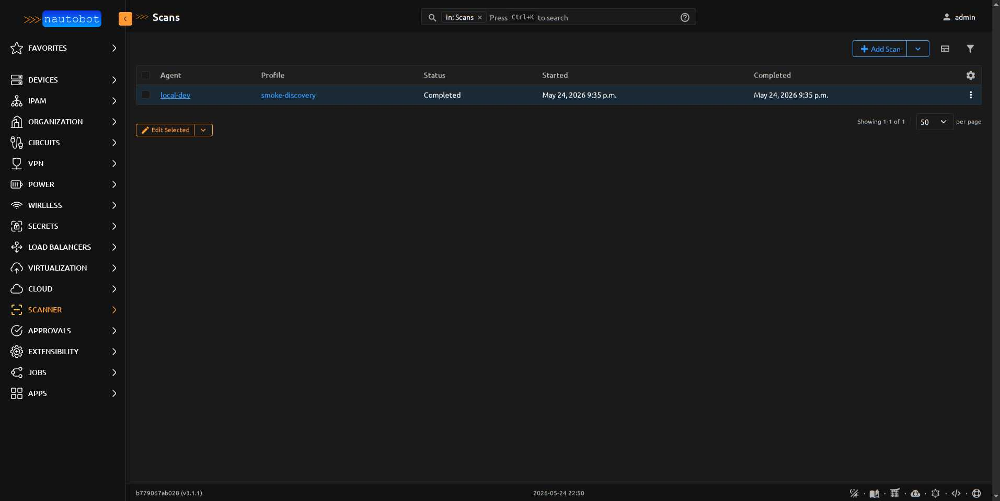
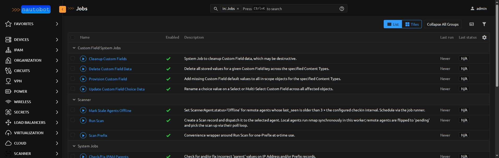
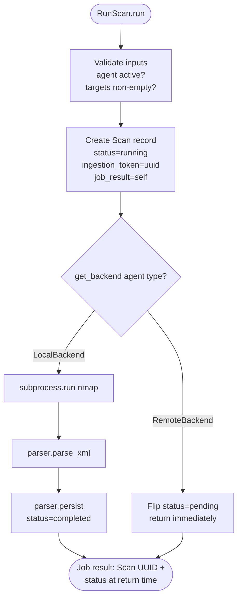
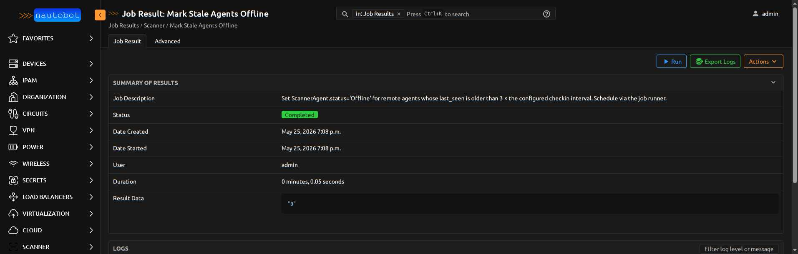
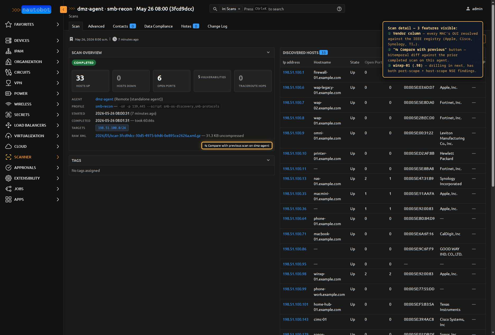
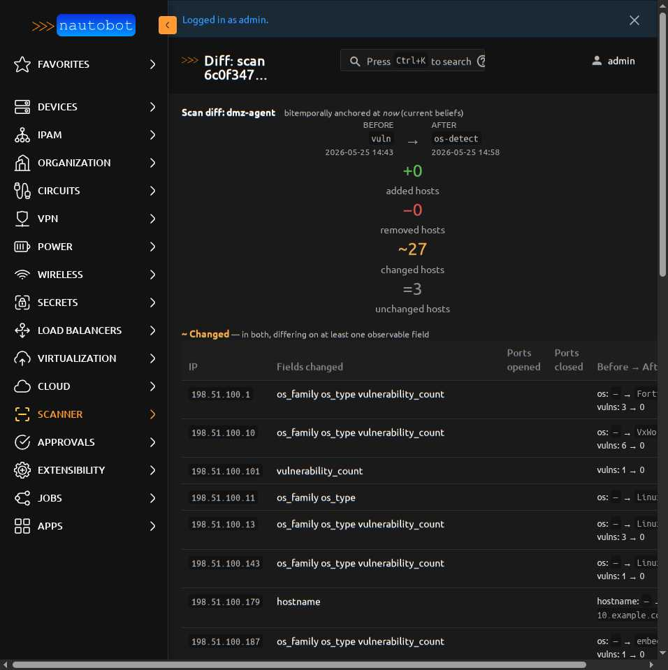

# Running Scans

Scans are dispatched via Nautobot **Jobs**. This means they integrate
with Nautobot's built-in job machinery: scheduling, audit trail, log
streaming, retry, and the `JobResult` page.

<figure markdown>

<figcaption>The **Scans** list view groups every run with its lifecycle state, agent, profile, and timestamps.</figcaption>
</figure>

## The two scan jobs

| Job | Inputs | Notes |
|-----|--------|-------|
| `RunScan` | agent, profile, target_prefixes, target_ipaddresses, allow_overlap | The general-purpose scan dispatcher |
| `ScanPrefix` | prefix, (agent / profile auto-picked if not specified) | Convenience wrapper — point at a Prefix, go |

Both jobs are registered via `register_jobs()` and appear under
**Apps > Jobs** in the Nautobot navigation.

<figure markdown>

<figcaption>All three Scanner-app Jobs registered under the `nautobot_scanner.jobs` grouping — `RunScan`, `ScanPrefix`, and the housekeeping `MarkStaleAgents`.</figcaption>
</figure>

## Lifecycle in the dispatching Job

For local backends the Job blocks until the scan completes (or fails or
times out). For remote backends the Job returns immediately and the
`Scan` row moves to `completed` later, when the agent posts back via
`POST /ingest/` — see the [Agent Protocol sequence diagram](../dev/agent_protocol.md#lifecycle).

## Scheduling

Use Nautobot's built-in job scheduler — there is no custom
`ScanSchedule` model in this app. From the Jobs page:

1. Click into `RunScan`
2. Fill the form as you would for an immediate run
3. Switch the **Schedule** dropdown from "Run Now" to **Hourly /
   Daily / Custom (cron)**
4. Save

Nautobot will fire the job on the schedule you set; each fire creates
a new `Scan` row.

## Overlap policy

By default, dispatching a second scan against the same agent when an
earlier scan with overlapping targets is still `running` raises
`JobError`. This prevents:

- Two scans racing to update the same `DiscoveredHost` rows
- The UI showing a misleading status while the agent is actually
  serializing scans
- Operators firing 5 scans in a panic and waiting hours

Check **Allow overlap** in the Run Scan form to bypass the guard when
you know what you're doing (e.g., a discovery scan and a port scan can
safely overlap).

## Cancellation

Set `Scan.cancel_requested = True` on a running scan to request a
clean halt. The behavior depends on the backend:

- **Local backend**: the in-process nmap subprocess gets a SIGTERM after
  the current host finishes (TODO: confirm subprocess signal handling
  in the Phase 6 implementation)
- **Remote agent**: the agent polls `cancel_requested` between hosts
  during its scan; honoring it is implementation-defined per agent. The
  reference agent honors it within ~10 seconds.

Cancelled scans transition to `status=cancelled` — they keep whatever
partial results were already ingested.

## Reading the JobResult

Every Scan's `job_result` FK points to the `extras.JobResult` record
for the dispatching Job. That's where you'll find:

- Per-host stdout/stderr from nmap (info-level log lines)
- Parser warnings (info / warning)
- Persist errors (error / failure)
- Final exit status (success / failure)

Click the **Job Result** link on a Scan detail page to see the full
log stream.

<figure markdown>

<figcaption>A completed `MarkStaleAgents` JobResult. The **Result Data** value (`"0"` here) is the count of agents flipped this run — when an agent is already `Offline`, the query correctly excludes it, so a follow-up sweep is a no-op.</figcaption>
</figure>

## Reading a scan detail page

Each scan's detail page surfaces three operationally important things
beyond the basics (status, profile, target ranges):

<figure markdown>

<figcaption>A completed `smb-recon` scan. The annotation calls out: (1) the **Vendor** column on the discovered-hosts table, populated by resolving every MAC's OUI against the IEEE registry at ingest time (`mac_vendor` field on `DiscoveredHost`); (2) the **Compare with previous scan** button that opens the [scan diff view](scan_diff.md); (3) a row like `winxp-01` (`.98`) that's about to be drilled into in the next view to see both port-scope and host-scope NSE findings on the same host.</figcaption>
</figure>

## Comparing scans — drift detection

Once you have two or more completed scans on the same agent, the
**Compare with previous scan on \<agent\>** button (visible in the
shot above) surfaces a side-by-side diff: added hosts, removed
hosts, changed hosts (with per-field deltas), and an unchanged count.

<figure markdown>

<figcaption>Diff summary tiles for a same-agent comparison. `vuln` → `os-detect` on 30 hosts: zero churned in or out, 27 had observable field changes (OS fingerprints newly populated, vuln counts dropped because the second profile doesn't run `vulners`), 3 unchanged. See [Comparing Scans](scan_diff.md) for the full walkthrough.</figcaption>
</figure>

The diff is computed via the pure-function machinery in
`nautobot_scanner.diff` — accessible programmatically too (`from
nautobot_scanner.diff import diff_scans`) for reporting, webhooks, or
alerting. See [Comparing Scans](scan_diff.md) for the data model,
which fields count as "changed," the bitemporal anchoring story, and
the `?vs=<other_scan_pk>` URL parameter for non-default comparisons.
