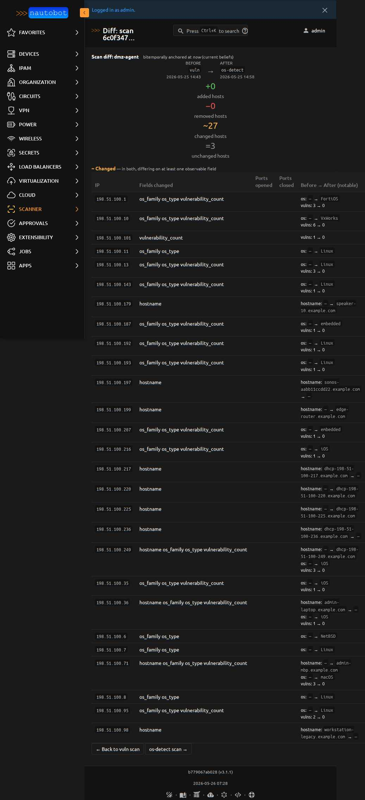

# Comparing Scans

Every completed scan on the same agent can be diffed against any other
completed scan from that agent. The diff view answers the most common
operator question: **"what changed since the last scan?"**

<figure markdown>

<figcaption>A full scan-diff page comparing a `vuln` scan to a follow-up `os-detect` scan on the same agent. 27 hosts had observable changes (mostly OS fingerprints appearing for the first time and vulnerability counts dropping because `os-detect` doesn't run the `vulners` NSE script). IPs and hostnames are sanitized to RFC 5737 / `.example.com` placeholders.</figcaption>
</figure>

## Opening the diff view

Every completed scan detail page has a **Compare with previous scan on
\<agent\>** button in the lower-right. Clicking it auto-picks the most
recent prior completed scan on the same agent.

To compare against a *specific* other scan instead, append `?vs=<scan_pk>`
to the URL:

```
/plugins/scanner/scans/<this_pk>/diff/?vs=<other_pk>
```

If you click **Compare** on the first-ever scan for an agent — nothing
to compare against — you get a flash warning and bounce back to the
scan detail page.

## What the diff classifies

A host belongs in exactly one of four buckets, computed by intersecting
the two scans' host populations by IP address:

| Bucket | Meaning | Color |
|---|---|---|
| **Added** | In AFTER, not in BEFORE | Green |
| **Removed** | In BEFORE, not in AFTER | Red |
| **Changed** | In both, differing on at least one observable field | Amber |
| **Unchanged** | In both, byte-for-byte identical on every compared field | Muted gray |

The headline tiles render even when their bucket is empty (so `+0 / -0`
is a meaningful "no churn" signal rather than a hidden section).

## What counts as "changed"

Only fields that represent real observable change are compared. The
list lives in `nautobot_scanner/diff.py:_COMPARED_FIELDS`:

- `host_state` — up / down / unknown / skipped
- `hostname`
- `mac_address`
- `mac_vendor`
- `os_family`
- `os_type`
- `open_ports` — compared as a *set* of `(port, protocol)` tuples, so
  port order doesn't matter
- `vulnerability_count`

Fields that *don't* count toward "changed":

- `created` / `last_updated` timestamps — every re-scan moves them
- `entry_id` — bitemporal book-keeping (see [DiscoveredHost](../models/discoveredhost.md))
- The `scan` FK itself — obviously different between the two scans

When a host is in the "Changed" table, the **Fields changed** column
lists which compared fields differ; the **Before → After (notable)**
column expands the most readable subset (state / hostname / vendor /
OS / vuln count) inline.

For ports specifically, the **Ports opened** / **Ports closed** columns
show the green-prefixed `+443/tcp` deltas and red-prefixed `-8080/tcp`
deltas — set difference, not list diff, so an unchanged port stays
out of both columns.

## Why "bitemporally anchored at *now*"

The header strip says "bitemporally anchored at *now* (current beliefs)."
This is a real distinction.

`DiscoveredHost` is a **bitemporal** model: every row tracks both *valid
time* (when nmap actually observed the host) and *recorded time* (when
scanner first / last believed this row to be the current state). See
[DiscoveredHost](../models/discoveredhost.md) for the field-by-field detail.

For a diff, the question "what changed between scan A and scan B" has
two answers depending on which time axis you anchor:

1. **Anchored at "now"** *(what the UI currently shows)* — uses the
   currently-believed row for each `(scan, ip)` pair. If you re-parsed
   scan A yesterday after fixing a parser bug, the diff reflects the
   corrected interpretation, not the original.
2. **Anchored at recording-time T** *(machinery exists, UI doesn't expose
   it yet)* — reproduces what the diff would have shown if you'd run it
   at time T, using whatever rows were the current belief at that moment.
   `diff_scans(scan_a, scan_b, as_of=<datetime>)` accepts this anchor as
   a kwarg; a `?as_of=` query param is a planned UI surface.

The second mode is the operational payoff of paying the bitemporal cost:
a colleague's report from last week stays reproducible even after a
re-parse, because the historical belief rows are still in the table —
just with a closed `recorded_during` upper bound instead of an open one.

## How the diff handles re-scans of moving targets

Two real-world patterns the diff handles naturally:

**DHCP churn.** The same IP picked up a different hostname between scans
because the lease moved to a new device. Shows up as a `hostname`
field-change with the before/after both populated. Not "added" or
"removed" — same IP, different name.

**Profile change.** Switching from `discovery` (no port scan) to
`top-100-tcp` produces a massive `open_ports` delta on every host that
was up. The diff renders this honestly — those *are* observable changes,
even though nothing changed on the wire. Operators read the BEFORE/AFTER
profile names in the header strip and adjust their interpretation.

## What the diff is *not*

- **Not a tcpdump-style line-diff.** It operates on the parsed `DiscoveredHost`
  records, not the raw nmap XML. If you want the raw XML diff, the per-scan
  download link on each scan detail page gives you `.xml.gz` files; pipe them
  through `xmldiff` yourself.
- **Not a vulnerability-finding diff.** If the same `vulners` finding
  appears on both scans, the diff sees `vulnerability_count` as unchanged
  even if the individual `NseFinding.output` strings differ.
  Per-finding deltas are a future enhancement — for now, click into the
  host detail page to compare findings directly.
- **Not cross-agent.** Diffing two scans on *different* agents is
  technically possible via `?vs=` but the operational meaning is murky
  (different source IPs, different network reach). Stick to same-agent
  diffs for drift detection.

## API access

The diff machinery is pure functions in `nautobot_scanner.diff`:

```python
from nautobot_scanner.diff import diff_scans, previous_scan_on_agent
from nautobot_scanner.models import Scan

after = Scan.objects.get(pk="6c0f347b-...")
before = previous_scan_on_agent(after)
result = diff_scans(before, after)

print(f"Added:     {len(result.added)}")
print(f"Removed:   {len(result.removed)}")
print(f"Changed:   {len(result.changed)}")
print(f"Unchanged: {result.unchanged_count}")

for host_change in result.changed:
    print(f"{host_change.ip_address}: {host_change.fields_changed}")
    for port, proto in host_change.ports_opened:
        print(f"  +{port}/{proto}")
```

`diff_scans` returns a `ScanDiff` dataclass with `.added`, `.removed`,
`.changed`, `.unchanged_count`, and a `.has_drift` property for the
"is there any churn at all?" shortcut. `HostChange` rows carry
`.ports_opened` and `.ports_closed` as `frozenset[tuple[int, str]]` —
ready to feed into reports, webhooks, or alerting.

## See also

- [Running Scans](running_scans.md) — dispatching scans, the JobResult page
- [DiscoveredHost](../models/discoveredhost.md) — the bitemporal model the diff queries
- [Scanner Agents](agents.md) — why the diff is scoped per-agent
