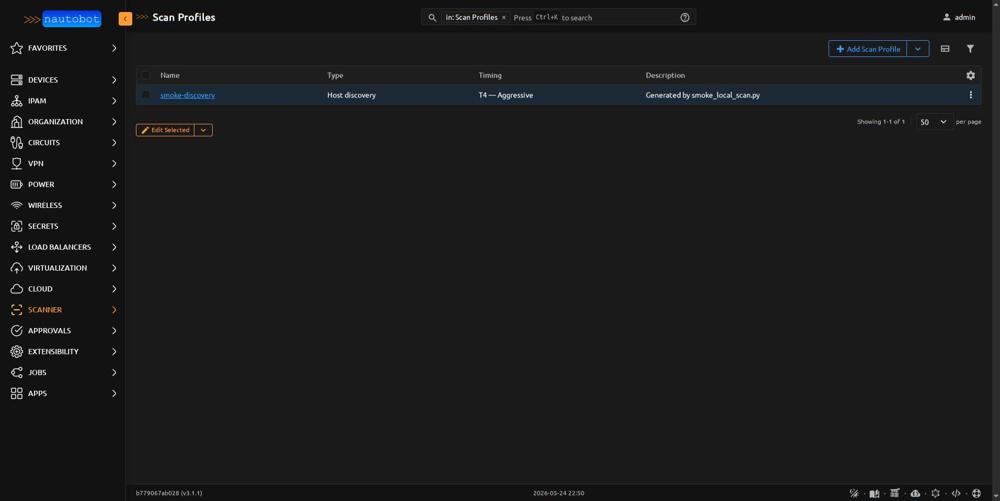
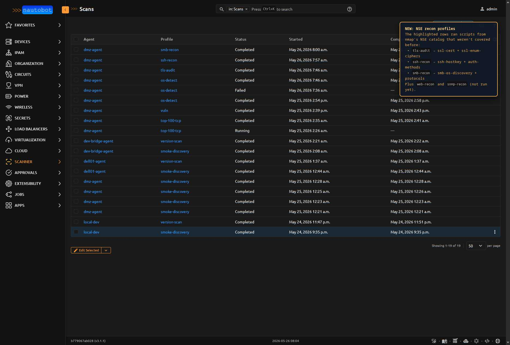
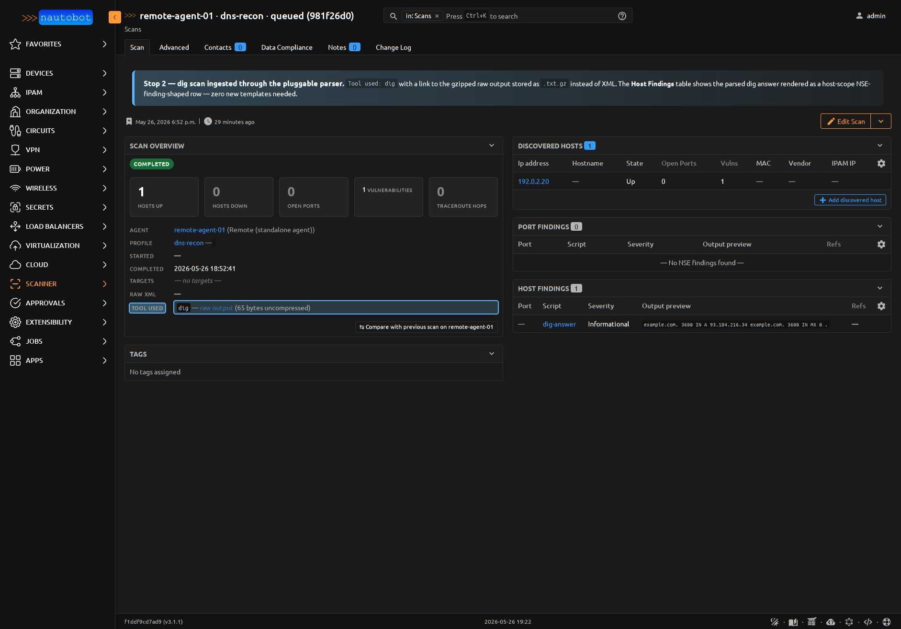
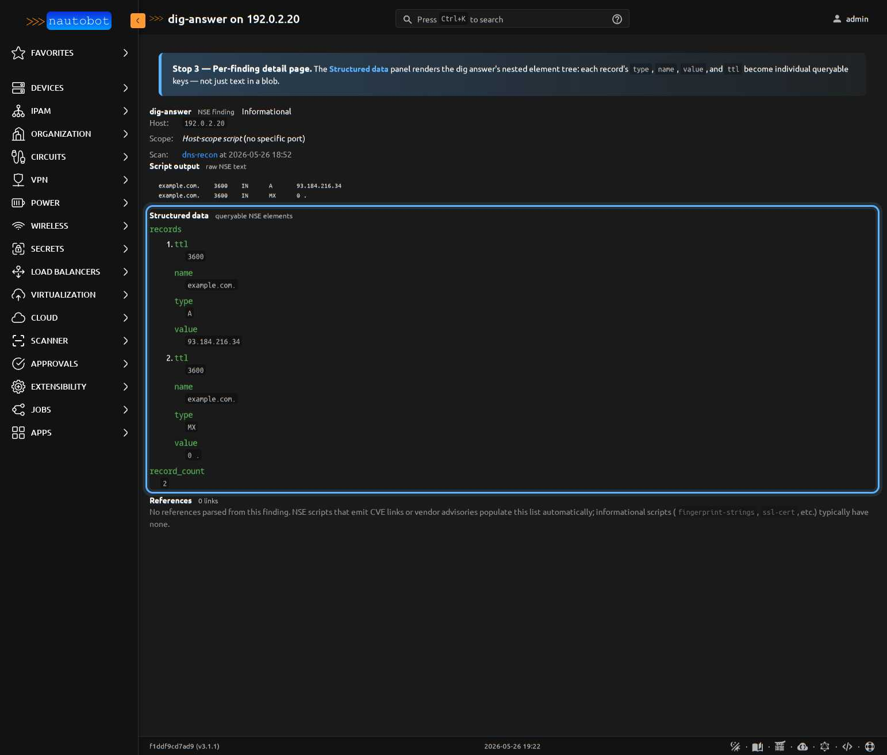

# Scan Profiles

A `ScanProfile` is a reusable probe-tool argument template — name, scan
type, the tool to invoke (`nmap` / `dig` / `drill` / `curl` / `mtr` /
`masscan` / `openssl-s_client`), the tool's argument string, timing
template, and an optional list of NSE scripts. The same profile can be
re-used by any agent for any target.

<figure markdown>

<figcaption>Scan profiles list — each row links to a detail/edit page; the **Add Scan Profile** button creates a new one.</figcaption>
</figure>

## Shipped profiles

**22 profiles** ship by default across six families: 7 nmap baseline,
5 NSE service recon, 2 DNS (dig + drill), 4 Phase-J non-nmap tools,
2 Phase-L deep-audit tools (testssl.sh + ssh-audit),
**1 Phase-L+1a modern-web-recon tool** (httpx), and 1 pentest demo.
All are seeded by data migrations the first time you
`nautobot-server migrate` after install. Most operators won't need to
write their own; pick the closest fit and dispatch.

### Discovery + port-scan baseline (7 profiles)

| Name | nmap args | Use case |
|---|---|---|
| `discovery` | `-sn` | Host discovery only. Cheap (one packet per host). Use as the first scan against an unknown subnet to find what's alive. |
| `top-100-tcp` | `-sV --top-ports 100` | The default port-scan answer. Service + version detection on the top 100 TCP ports. |
| `os-detect` | `-sS -sV -O --top-ports 100 --osscan-limit` | TCP scan + OS fingerprint. The only profile that populates `DiscoveredHost.os_family` / `os_type` / `os_accuracy`. `--osscan-limit` skips hosts without an open+closed port pair so firewalled targets don't fill the UI with 0% guesses. Requires `cap_net_raw` on the scanner. |
| `full-tcp` | `-sS -sV -O -p-` | Deep dive — every TCP port (1-65535) with version detection + OS fingerprint. Slow (minutes for /24). Use on suspect hosts, not blanket sweeps. |
| `vuln` | `-sV --top-ports 100` + `vulners` NSE | Same shape as `top-100-tcp` plus CVE annotations on findings via the `vulners` script. |
| `topology` | `-sn --traceroute` | Discovery + traceroute for layer-3 path mapping. Populates `TraceRouteHop` records. |
| `udp-common` | `-sU --top-ports 50` | The only UDP profile shipped. Catches DNS / SNMP / NTP / DHCP / syslog without taking hours (UDP scanning is ~50× slower than TCP). |

### Service-focused NSE recon (5 profiles)

Added in migration `0010` once the [NseFinding model was generalized
to support host-scope output](../models/nsefinding.md#port-scope-vs-host-scope).
Each profile narrows nmap to a single service category and exercises
the NSE scripts that produce findings landing on the host or its ports.

<figure markdown>

<figcaption>The Scans list with NSE recon profiles in active rotation against an example `dmz-agent`. The annotated overlay calls out which scripts each new profile fires (`tls-audit` → `ssl-cert` + `ssl-enum-ciphers`, `ssh-recon` → `ssh-hostkey` + `ssh-auth-methods`, `smb-recon` → `smb-os-discovery` + `smb-protocols`). `web-recon` and `snmp-recon` exist as profiles but hadn't been dispatched yet at capture time.</figcaption>
</figure>

| Name | nmap args + NSE scripts | What it produces |
|---|---|---|
| `web-recon` | `-sV --top-ports 100 --script http-title,http-headers,http-methods,http-server-header` | Per-port `NseFinding` rows on every HTTP/HTTPS port with the page title, response headers, allowed methods, and `Server:` banner. Useful before a pen-test pass to inventory the web surface. |
| `tls-audit` | `-sV --top-ports 100 --script ssl-cert,ssl-enum-ciphers` | Cert subject/issuer/expiry on every TLS port plus the enumerated cipher suites. Real finding from running this against a home LAN in testing: a printer's mgmt cert was RSA-1024 + MD5 + dated 2012. Compliance audit fodder. |
| `smb-recon` | `-sV -p 139,445 --script smb-os-discovery,smb-protocols` | Host-scope `NseFinding` rows describing the SMB stack + offered protocol versions. nmap annotates SMBv1 as "dangerous, but default" — that's still surfacing real EternalBlue-vulnerable hosts in 2026. |
| `snmp-recon` | `-sU -p 161 --script snmp-info,snmp-sysdescr` | UDP-only profile — community-string-guessed SNMP info and sysDescr. Lands as host-scope findings. **Uses only nmap's built-in default `public` community** — quiet, low-noise recon. |
| `snmp-recon-deep` | `-sU -p 161 --script snmp-info,snmp-sysdescr,snmp-brute --script-args snmpcommunity.wordlist=/etc/scanner/snmp-defaults.txt` | Phase M.1 upgrade — tries a ~25-entry wordlist of default community strings (`public`, `private`, `cisco`, `apc`, `axis`, …) via `snmp-brute`, then dumps `sysObjectID` + `sysDescr` on any that answer. **Credential-attempt: use ONLY via `snmp_recon_undocumented` management command** to restrict targeting to hosts not already in IPAM (documented devices already-known SNMP → auth-trap noise on the operator's own SOC). See [Phase M design brief](../dev/phase-m-fingerprint-design.md). |
| `ssh-recon` | `-sV -p 22 --script ssh-hostkey,ssh-auth-methods` | Host key fingerprints + accepted auth methods (password / publickey / keyboard-interactive). Detect SSH hosts still accepting password auth. |

All 12 use timing template `T4` (aggressive, fast). Edit any profile
in the UI to slow it down for stealthier contexts.

!!! tip "NSE recon profiles produce findings, not vulnerabilities"
    The 5 recon profiles surface their output as `NseFinding` rows
    with `severity='info'` — they're informational, not
    vulnerability findings. The `vuln` profile is the only shipped
    profile that produces CVE-bearing `severity='high'` / `critical`
    findings (via the `vulners` script). Combine them: run
    `tls-audit` to inventory TLS endpoints, then `vuln` against the
    same range to flag known-CVE OpenSSL versions found there.

### Non-nmap profiles (Phase G + G' + J)

The multi-tool dispatch path landed in three steps:

- **Phase G** (migration `0015`) — `dig`, proving one non-nmap parser
  could ride the same agent/ingest/parser dispatch as nmap.
- **Phase G'** (migration `0017`) — `drill`, complementing `dig` with
  first-class DNSSEC validation.
- **Phase J** (migration `0018`) — the four remaining tools the
  `ToolChoices` dropdown promised: `curl`, `mtr`, `masscan`,
  `openssl-s_client`. Closes the "dropdown lies" gap.

#### DNS recon (2 profiles)

| Name | Tool | `tool_arguments` | What it produces |
|---|---|---|---|
| `dns-recon` | `dig` | `+noall +answer ANY` | Per-target DNS record snapshot. The agent runs `dig` against each target, gzips the answer body to `Scan.raw_output`, and the server materializes one host-scope `NseFinding` per target with the records in `elements`. |
| `dnssec-trace` | `drill` | `-DT` | Same shape as `dns-recon` plus the DNSSEC validation flags from drill's `;; flags:` header. Detects unsigned or bad-chain delegations across the trust path. |

!!! info "dig and drill scans also promote into typed DNS records (Phase K)"
    As of Phase K, every dig/drill answer record gets promoted into
    `nautobot-app-dns-models` during ingest — `A` / `AAAA` / `CNAME` /
    `MX` / `NS` / `TXT` / `PTR` / `SRV` records all materialize as
    rows in the right typed table. A
    [`DnsRecordProvenance`](../models/dnsrecordprovenance.md) row
    joins each promoted record back to the source `NseFinding`, so
    "which dig scan saw this `A` record?" is a one-clause filter.
    A/AAAA records that resolve to IPs not in IPAM are skipped (the
    raw value still lives on the provenance row); see
    [ADR-015](../dev/architecture.md#adr-015-promote-dig-and-drill-into-typed-dns-models)
    for why.

<figure markdown>

<figcaption>A completed `dns-recon` scan. **Tool used: dig** badge, raw output stored as `.txt.gz` (not `.xml.gz`), and the Host Findings table shows the parsed dig answer rendered as one host-scope `NseFinding` row — no new templates needed because the existing finding-rendering machinery handles it.</figcaption>
</figure>

<figure markdown>

<figcaption>Drilling into the dig finding's detail page: the structured `elements` JSONField renders via the type-aware partial — DNS records appear as a clean list rather than buried inside raw text. Same partial works for ssl-cert validity windows, smb-os-discovery OS strings, http-headers maps.</figcaption>
</figure>

#### Phase J: HTTP, path, port-sweep, TLS (4 profiles)

| Name | Tool | `tool_arguments` | What it produces |
|---|---|---|---|
| `http-probe` | `curl` | *(none — defaults to GET)* | Per-target HTTP response snapshot. One host-scope `NseFinding` per target with structured elements `status_code`, `content_type`, `time_total_ms`, `num_redirects`, `url_effective`, plus every response header nested under `headers{}` (so `?elements__headers__server__icontains=cloudflare` works as a queryable filter). |
| `path-baseline` | `mtr` | `-c 20` | Per-target traceroute + per-hop latency baseline. JSON output captured into a list of `{ttl, host, loss_pct, avg_ms, jitter_ms, …}` dicts. Severity escalates to **medium** when any hop loses >10% and **high** when the target itself loses >50%. |
| `masscan-sweep` | `masscan` | `-p 0-65535 --rate 50000` | Fast full-range port sweep — the only Phase J tool that produces `DiscoveredHost` + `DiscoveredPort` rows directly (no `NseFinding` layer). **Auto-tripped pentest-mode** at 10k+ pps — see [the pentest gating note below](#pentest-profiles-phase-i-and-j). |
| `tls-quick-check` | `openssl-s_client` | `-showcerts -tls1_3` | Per-target TLS handshake + certificate dump. Structured elements `subject`, `issuer`, `not_before`, `not_after`, `days_until_expiry`, `cipher`, `protocol`, `verify_ok`. Severity escalates to **medium** under 30 days and **high** under 7 days from expiry. |

End-to-end-verified against real tool output during Phase J — see the
commit message for `4705b69` ("Wire the 4 advertised tools end-to-end")
for the per-tool verification: `curl https://example.com` →
`status_code=200`, `server='cloudflare'`, `time_total_ms=73`,
`severity=info`; `mtr -j 1.1.1.1` → 8 hops parsed, hop 3 (firewall) at
100% loss, `severity=medium` auto-escalated; `openssl s_client
example.com:443` → `days_until_expiry=35`, `verify_ok=True`.

#### Phase L: deep audit pair (2 profiles)

The Phase J `tls-quick-check` and the nmap `ssh-recon` NSE pair are
**deliberately shallow** — one TLS handshake snapshot and two host-key
scripts respectively. Phase L pairs them with **compliance-grade deep
audit tools** that test every protocol, every cipher, every named
vulnerability signature, and every algorithm offered. Both produce
native JSON with ordinal severity baked in (`OK`/`LOW`/`MEDIUM`/`HIGH`/
`CRITICAL` for testssl, `info`/`warn`/`fail` notes per algorithm for
ssh-audit). Neither is pentest-class — both make standard handshakes,
no exploit attempts.

| Name | Tool | `tool_arguments` | What it produces |
|---|---|---|---|
| `tls-audit-deep` | `testssl` | *(empty — full audit)* | Per-target host-scope `NseFinding` with rich `elements`: `protocols_offered`, `cert_subject`, `vulnerabilities[]` (heartbleed, BEAST, POODLE, ROBOT, LUCKY13, CRIME, BREACH, CCS, ticketbleed, RC4, FREAK, LOGJAM, DROWN, SWEET32 — each with severity + finding text), `weak_ciphers[]`, `chain_issues[]`, `hsts`, `ocsp_stapling`, `severity_counts` histogram. The panel-level severity is the **worst** across all per-test rows. |
| `ssh-audit` | `ssh-audit` | *(empty — bare audit)* | Per-target host-scope `NseFinding` with `elements`: `banner`, `software`, `version`, `kex_algos[]`, `host_keys[]`, `macs[]`, `ciphers[]`, `compression[]`, `fingerprints[]` (SHA256 + MD5 per host-key), `weak_algos[]` (every algorithm with fail/warn notes), `cves[]`, and a recommendation-count summary. Severity climbs from `info` → `low` → `medium` → `high` based on warn/fail notes and CVE CVSS scores. |

Verified end-to-end during Phase L development:

- `testssl example.com:443` (152s) → 255 tests per Cloudflare edge IP,
  2 ParsedHosts (one per edge), 18 distinct vulnerability test rows
  surfaced as a queryable table in the finding-detail UI (severity
  badge per row), `severity=high` rolled up from one HIGH row in the
  catalog.
- `ssh-audit github.com` (29s) → banner captured, 9 KEX algos, 5 host
  keys, 4 MACs, 6 ciphers, **8 weak algos flagged** (GitHub's
  NSA-suspect ECDH curves trigger the `fail` notes), 6 fingerprints
  recorded across SHA256 + MD5, `severity=medium` rolled up from
  fail-note presence.

The shallow Phase-J `tls-quick-check` and the nmap NSE `ssh-recon`
profile **stay alongside** the new deep-audit pair — different points
on the speed-vs-depth curve, picked per use case. Quick check for "is
the cert still valid before this deploy?", deep audit for compliance
review or "should we publish this externally?"

#### Phase L+1a: modern HTTP probe (1 profile)

[ProjectDiscovery](https://projectdiscovery.io)'s `httpx` is the
modern successor to the Phase J `http-probe` (curl) profile —
JSONL-native, ~30 fields per target by default, includes TLS
handshake metadata, technology fingerprinting (React, GitHub Pages,
Cloudflare, etc.), CDN identification, and per-target DNS records.
Replaces curl for compliance + inventory use cases while curl stays
as the diagnostic-shell alternative.

| Name | Tool | `tool_arguments` | What it produces |
|---|---|---|---|
| `http-probe-rich` | `httpx` | `-tls-grab -tech-detect -title -server -web-server -content-length -ip -response-time -status-code -timeout 15` | Per-target host-scope `NseFinding` with `elements`: `url`, `status_code`, `title`, `webserver`, `content_type`, `content_length`, `tech[]` (fingerprinted stack), `response_time`, `method`, `path`, `cdn`/`cdn_name`, `host_resolved` (IP from httpx's own resolver), `a_records[]`/`aaaa_records[]`. For HTTPS targets the nested `tls{}` sub-dict carries `version`, `cipher`, `subject_cn`, `subject_an[]`, `issuer_cn`, `not_before`, `not_after`, `days_until_expiry`, `fingerprint_sha256`. |

Severity heuristic mirrors the rest of the Phase L+ tools:
- 5xx response → `medium`
- 4xx response or `failed=true` → `low`
- Cert expiring `<7 days` → `high`, `<30 days` → `medium`
- Off-domain redirect → `low` (Location header points elsewhere)
- Otherwise → `info`

Verified end-to-end during Phase L+1a development:

- `httpx -json` against `example.com`, `github.com`, and the demo
  Caddy edge in 2.0s total — 3 ParsedHosts. example.com gets
  `tech=['Cloudflare']`, github.com gets
  `tech=['Amazon S3', 'AWS', 'Contentful', 'GitHub Pages', 'HSTS', 'React']`,
  the demo Caddy gets `tech=['HTTP/3']`. Cert `days_until_expiry`
  populated for all three (58, 85, 81 respectively); all
  `severity=info` (clean state — modern certs, 2xx responses).

The Phase J `http-probe` (curl) profile **stays alongside** — curl
shows you exactly which command-line flags produced the result, which
is irreplaceable for diagnostic-shell troubleshooting. httpx is the
JSON-shaped inventory tool; curl is the per-flag-traceable
diagnostic tool. Pick by use case.

Add your own non-nmap profile via **Scanner → Scan Profiles → Add**:
set `tool` to one of `dig` / `drill` / `curl` / `mtr` / `masscan` /
`openssl-s_client` / `testssl` / `ssh-audit` / `httpx`, fill in
`tool_arguments`, save. The agent's
capability probe declares which of these tools the host actually has
on startup, so an unrecognized tool fails the dispatch cleanly with
the missing-tool name in `Scan.error_message`.

### Pentest profiles (Phase I and J)

A profile is "pentest mode" — and therefore gated by the
`nautobot_scanner.use_pentest_profiles` permission — when either:

1. Any of the five nmap evasion flags is set on the profile
   (`decoy_addresses`, `fragment_packets`, `mtu`, `source_port`,
   `idle_scan_zombie`), **or**
2. The tool itself is in `ScanProfile.PENTEST_TOOLS` — currently
   `{"masscan"}`. masscan at the seeded 50k pps is unmistakable to any
   IDS regardless of flags, so the gating triggers on tool identity
   alone. See [Pentest Mode](pentest_mode.md) for legal notice and
   permission setup.

Two seeded pentest-class profiles ship today:

| Name | Tool | What it demonstrates |
|---|---|---|
| `demo-pentest` (migration `0016`) | `nmap` | Three evasion flags (`decoy_addresses`, `fragment_packets`, `source_port`) on top of a top-100 SYN scan. Starting point for your own nmap pentest profiles. |
| `masscan-sweep` (migration `0018`) | `masscan` | Tool-identity gating — no evasion flags set, but `tool == "masscan"` widens `is_pentest_mode` to `True` automatically. See [Phase J profiles](#phase-j-http-path-port-sweep-tls-4-profiles) above. |

Either way the audit row stamps `Scan.was_pentest_mode=True` regardless
of who later edits the profile.

!!! info "OS fingerprint data missing?"
    Only profiles with `-O` populate the `os_family` / `os_type` /
    `os_accuracy` fields on `DiscoveredHost`. `os-detect` and the
    upgraded `full-tcp` are the two shipped profiles that do this.
    Some hosts still come back blank — nmap needs both an open and a
    closed TCP port for a confident TCP/IP-stack signature, and
    consumer IoT (Sonos, Lutron, etc.) often don't match nmap's DB
    even when probed. Enterprise gear (FortiGate, HP printers,
    Synology NAS, macOS) typically fingerprints at 87-100% confidence.

!!! tip "Edits survive upgrades"
    The seed migration uses `get_or_create` keyed on profile name —
    re-running migrations after you've edited a default profile won't
    overwrite your changes. Renaming a default profile also "orphans"
    it from the seeder, so the next upgrade will recreate the
    canonical version alongside your edited copy.

## Why profiles exist

You probably don't want operators typing nmap arguments into the Run
Scan job every time. Profiles let you curate a small set of vetted
recipes (`discovery-fast`, `tcp-full-vuln`, `udp-top-100`, etc.) and
let operators pick by name.

The `scan_type` field is a coarse classification used by table filters
and panel-rendering decisions — but `nmap_arguments` is always the
source of truth for what gets passed to the binary.

## Writing your own profile

When the defaults don't fit — you need OS fingerprinting, a specific NSE
script, IDS-evasion timing, or a non-standard port set — create a
custom profile via **Apps > Scanner > Scan Profiles > Add**.

Two recipes the defaults don't cover, as a starting point:

### TCP top-1000 + OS fingerprint

| Field | Value |
|-------|-------|
| `scan_type` | `version` |
| `nmap_arguments` | `-sS -sV -O --top-ports 1000` |
| `timing_template` | `T4` |

SYN scan with version detection plus `-O` OS fingerprinting. Populates
`DiscoveredHost.os_family` / `os_type` / `os_accuracy` (which the
shipped `top-100-tcp` profile doesn't because `-O` needs raw sockets
and a probe-able TCP port).

### Stealth / IDS-evasion (slow)

| Field | Value |
|-------|-------|
| `scan_type` | `port` |
| `nmap_arguments` | `-sS -f --data-length 200` |
| `timing_template` | `T1` |

`T1` "Sneaky" timing + fragmented packets + decoy traffic length.
Won't trip most IDS thresholds; takes minutes per host. Use against
hosts you suspect have active monitoring you don't want to alert.

## What you cannot put in `nmap_arguments`

The backend appends targets to whatever you specify in
`nmap_arguments`. **Do not include target specifications** in the
profile — they come from the Scan's `target_prefixes` /
`target_ipaddresses` at dispatch time.

The backend also appends `-oX -` to capture XML output on stdout. **Do
not specify `-oX` or other output flags** in the profile — they'll
collide.

## NSE script-name validation

The `enabled_scripts` JSON field is informational — it's a hint for
operators about which scripts a profile uses. It does **not**
automatically get appended to the nmap command line. To run scripts,
include `--script <name>` in `nmap_arguments` explicitly.

## Timing templates

| Template | Meaning | Typical use |
|----------|---------|------------|
| `T0` | Paranoid | IDS evasion (~5 min per host) |
| `T1` | Sneaky | IDS evasion (~15 sec per port) |
| `T2` | Polite | Slow / quiet (default in some firewalls) |
| `T3` | Normal | Default — balanced |
| `T4` | Aggressive | Fast, modern networks — recommended |
| `T5` | Insane | Very fast, packet loss likely |
